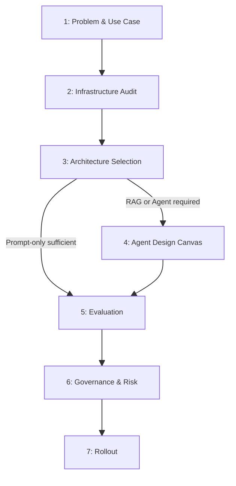
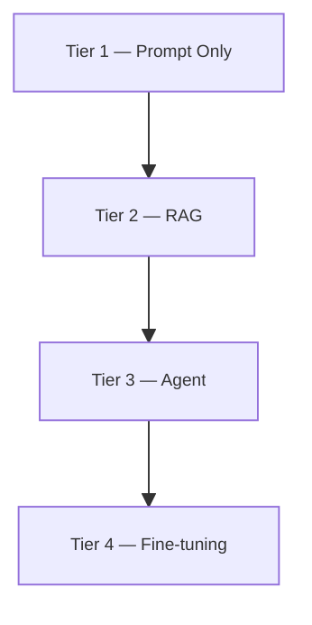

# Evaluation Strategy — Agent Template

> This document is an **agent-driven template**. It is invoked by the Evaluator subagent (see `.claude/agents/evaluator.md`) against a single client-input document. The agent walks the phases below, fills in what it can determine, and flags the rest for the human AI architect.

## Input Contract

The agent receives **one** of:

- A path to a single document containing client business requirements (markdown, PDF, plain text, transcript, etc.)
- A path plus an explicit section reference (e.g., `intake.md#requirements`) — the agent confines its analysis to that section
- Raw text passed inline

The agent does **not** consult external sources, prior conversation memory, or any artifact outside the named input. If something is not derivable from the input, the answer is `UNKNOWN`.

## Output Contract

The agent emits **two artifacts in a single response**:

1. A filled copy of this template (Phases 1–7 below) with every field populated.
2. A **Structured Output** block (YAML) at the end, mirroring all fields. This block is the machine-readable handoff to downstream ADLC agents.

Both artifacts must agree. If they conflict, the human architect treats the YAML block as authoritative.

## Confidence Tags

Every filled field carries a confidence tag:

| Tag | Meaning |
| --- | ------- |
| `FOUND` | Stated explicitly in the client input. Cite the source (quote or section anchor). |
| `INFERRED` | Reasoned from context. Provide a one-sentence rationale. |
| `UNKNOWN` | Not determinable from the input. The human architect must resolve or accept as open. |
| `NA` | Field is not applicable given upstream decisions (e.g., Tool tables when Tier 1 is selected). |

`UNKNOWN` is an acceptable answer. The agent must never fabricate a value to avoid the tag.

## Field Markers

Fields use this format inline:

```
[FIELD: field_name | confidence: FOUND | source: "..." | value: ...]
```

For tables, each row's filled cells follow the same pattern. The agent preserves the table structure and adds the markers within cells.

## How the Agent Walks the Template

1. Read the entire client input once before answering any field.
2. Process Phases 1 → 7 in order; later phases depend on earlier decisions.
3. When an upstream field is `UNKNOWN`, propagate `NA` or `UNKNOWN` to dependent downstream fields rather than guessing.
4. Aggregate every `UNKNOWN` into the **Open Items** appendix with the phase that blocked it.
5. Emit the **Structured Output** YAML block last.

---

## Phase Overview



---

## 1. Problem & Use Case

**Goal:** Frame the problem before any architecture decisions are made.

### 1.1 Use Case Statement

*Jobs To Be Done format: "When [situation], I need to [motivation], so I can [outcome]."*

| Field | Response |
| ----- | -------- |
| When (situation / trigger) | `[FIELD: situation]` |
| I need to (task / motivation) | `[FIELD: motivation]` |
| So I can (expected outcome) | `[FIELD: outcome]` |
| Who are the users and what is their technical fluency? | `[FIELD: users]` |
| What does the current workflow look like? | `[FIELD: current_workflow]` |

### 1.2 Is AI the Right Tool?

The agent answers each gate, then records the resulting recommendation.

| Gate | Answer | Confidence |
| ---- | ------ | ---------- |
| Task well-defined with clear inputs/outputs? | `[FIELD: gate_well_defined]` | |
| Requires language understanding or generation? | `[FIELD: gate_language]` | |
| Correctness requires human-level judgment? | `[FIELD: gate_human_judgment]` | |

| Field | Value |
| ----- | ----- |
| Recommendation | `[FIELD: ai_fit_recommendation]` (one of: `proceed`, `human_in_loop_required`, `consider_deterministic`, `refine_problem_first`) |

### 1.3 Success Criteria

| Criterion | Metric | Target | Confidence |
| --------- | ------ | ------ | ---------- |
| Answer quality | Supported answer rate | `[FIELD: success_quality_target]` | |
| User adoption | Task completion rate | `[FIELD: success_adoption_target]` | |
| Escalation rate | % of tasks requiring human override | `[FIELD: success_escalation_target]` | |

---

## 2. Infrastructure Audit

**Goal:** Identify what already exists before scoping any build.

### 2.1 Existing Knowledge Systems

| Field | Value | Confidence |
| ----- | ----- | ---------- |
| Enterprise search platform exists? | `[FIELD: enterprise_search_exists]` (yes / no / unknown) | |
| Platform name (if yes) | `[FIELD: enterprise_search_name]` | |
| API or MCP integration available? | `[FIELD: enterprise_search_api]` (yes / no / unknown) | |
| Integration contract documented? | `[FIELD: enterprise_search_contract]` | |

*If an enterprise platform exists with API access, Phase 4.2 (Knowledge & Data) can be skipped — note this in `phase_4_canvas.knowledge_skipped` in the structured output.*

### 2.2 Existing Tooling

| Category | What exists | Integration complexity | Confidence |
| -------- | ----------- | ---------------------- | ---------- |
| Identity / auth | `[FIELD: tooling_identity]` | `[FIELD: tooling_identity_complexity]` | |
| Data stores | `[FIELD: tooling_data]` | `[FIELD: tooling_data_complexity]` | |
| Communication platforms | `[FIELD: tooling_comms]` | `[FIELD: tooling_comms_complexity]` | |
| Line-of-business systems | `[FIELD: tooling_lob]` | `[FIELD: tooling_lob_complexity]` | |

---

## 3. Architecture Selection

**Goal:** Choose the minimum viable architecture tier.



**Rule:** Start at Tier 1. Move up only when evidence shows the current tier is insufficient.

| Need | Minimum tier |
| ---- | ------------ |
| Consistent output format / tone | Tier 1 |
| Answers grounded in internal documents | Tier 2 |
| Multi-step task completion or write-back | Tier 3 |
| Consistent narrow behavior at scale | Tier 4 |

| Field | Value | Confidence |
| ----- | ----- | ---------- |
| Selected tier | `[FIELD: selected_tier]` (1 / 2 / 3 / 4) | |
| Rationale | `[FIELD: tier_rationale]` | |

---

## 4. Agent Design Canvas

*Reference: Microsoft Agent Design Framework. The agent fills only the cells relevant to the selected tier. Cells not applicable receive `NA`.*

### 4.1 Use Case & Triggers

| Element | Value | Confidence |
| ------- | ----- | ---------- |
| Use case goal (Jobs To Be Done restatement) | `[FIELD: canvas_goal]` | |
| Triggers (events that initiate the workflow) | `[FIELD: canvas_triggers]` | |
| Channels (where users interact with the agent) | `[FIELD: canvas_channels]` | |

### 4.2 Knowledge & Data

*Skip if an enterprise retrieval platform was selected in Phase 2 — mark fields `NA` and set `phase_4_canvas.knowledge_skipped: true` in the structured output.*

| Source | Format | Update frequency | Owner | Confidence |
| ------ | ------ | ---------------- | ----- | ---------- |
| `[FIELD: knowledge_source_1]` | | | | |

*The agent adds rows for each distinct knowledge source identified in the input.*

| Field | Value | Confidence |
| ----- | ----- | ---------- |
| Ingestion approach | `[FIELD: ingestion_approach]` (`framework` / `diy` / `enterprise_platform` / `na`) | |
| Chunking strategy | `[FIELD: chunking_strategy]` | |
| Curation owner | `[FIELD: curation_owner]` | |
| Update / supersession handling | `[FIELD: curation_updates]` | |

**Metadata schema** (define before ingestion — filter before retrieval, not after):

| Field | Required? | Confidence |
| ----- | --------- | ---------- |
| Source / document type | `[FIELD: meta_source]` | |
| Date / version | `[FIELD: meta_date]` | |
| Approval status | `[FIELD: meta_approval]` | |
| Scope / jurisdiction | `[FIELD: meta_scope]` | |

### 4.3 Tools & Integrations

*Tier 3 only. For Tier 1–2, mark all fields `NA`. Each tool added multiplies security surface — prefer read-only in v1.*

| Tool | Action type | Reversible? | Requires human approval? | Confidence |
| ---- | ----------- | ----------- | ------------------------ | ---------- |
| `[FIELD: tool_1]` | | | | |

*The agent adds rows for each distinct tool identified.*

### 4.4 Flows & Orchestration

| Field | Value | Confidence |
| ----- | ----- | ---------- |
| Selected pattern | `[FIELD: orchestration_pattern]` (`single_agent` / `pipeline` / `orchestrator_subagents` / `na`) | |
| Rationale | `[FIELD: orchestration_rationale]` | |

### 4.5 Instructions & Behavior

| Element | Decision | Confidence |
| ------- | -------- | ---------- |
| Agent role / persona | `[FIELD: behavior_role]` | |
| Output format | `[FIELD: behavior_format]` | |
| Citation behavior | `[FIELD: behavior_citation]` | |
| Abstention behavior | `[FIELD: behavior_abstention]` | |
| Scope boundary (what is out of scope) | `[FIELD: behavior_scope]` | |

### 4.6 Agent Architecture & Components

| Component | New or existing | Notes | Confidence |
| --------- | --------------- | ----- | ---------- |
| `[FIELD: component_1]` | | | |

*The agent adds rows for each distinct component, subagent, data fabric agent, or A2A external agent identified.*

---

## 5. Evaluation

**Goal:** Define how the system is measured before it is built.

### 5.1 Quality Metrics

Define hallucination operationally as **unsupported answer rate** — % of outputs not verifiable against retrieved, approved source evidence.

| Metric | Target | Confidence |
| ------ | ------ | ---------- |
| Supported answer rate | `[FIELD: eval_supported_rate]` | |
| Abstention rate | `[FIELD: eval_abstention_rate]` | |
| Task completion rate | `[FIELD: eval_completion_rate]` | |

### 5.2 Abstention Behavior

| Scenario | Required behavior | Confidence |
| -------- | ----------------- | ---------- |
| No relevant sources retrieved | `[FIELD: abstain_no_sources]` | |
| Low confidence match | `[FIELD: abstain_low_confidence]` | |
| Conflicting sources | `[FIELD: abstain_conflict]` | |
| Question out of scope | `[FIELD: abstain_out_of_scope]` | |

---

## 6. Governance & Risk

**Goal:** Identify constraints and attack surfaces before build.

### 6.1 Human-in-the-Loop Gates

| Action | Risk level | Gate | Confidence |
| ------ | ---------- | ---- | ---------- |
| `[FIELD: gate_action_1]` | | | |

*The agent adds rows for each distinct action requiring a gate decision.*

### 6.2 Security

| Field | Value | Confidence |
| ----- | ----- | ---------- |
| Prompt-injection mitigation strategy | `[FIELD: sec_prompt_injection]` | |
| Tool least-privilege approach | `[FIELD: sec_least_privilege]` | |
| Sensitive-field redaction in pipeline | `[FIELD: sec_redaction]` | |

### 6.3 Data & Deployment Constraints

| Requirement | Present? | Impact | Confidence |
| ----------- | -------- | ------ | ---------- |
| Data residency (must stay in region) | `[FIELD: data_residency]` | | |
| Air-gap / on-prem required | `[FIELD: data_air_gap]` | | |
| Regulated data (PII, PHI, financial) | `[FIELD: data_regulated]` | | |

| Field | Value | Confidence |
| ----- | ----- | ---------- |
| Selected deployment model | `[FIELD: deployment_model]` (`raw_api` / `managed_cloud` / `self_hosted`) | |
| Rationale | `[FIELD: deployment_rationale]` | |

---

## 7. Rollout

**Goal:** Ship with a safety net. Treat prompts, retrieval config, and model versions as versioned artifacts.

| Artifact | Versioned? | Requires eval before deploy? | Confidence |
| -------- | ---------- | ---------------------------- | ---------- |
| System prompt | `[FIELD: rollout_prompt_versioned]` | `[FIELD: rollout_prompt_eval]` | |
| Retrieval configuration | `[FIELD: rollout_retrieval_versioned]` | `[FIELD: rollout_retrieval_eval]` | |
| Model version | `[FIELD: rollout_model_versioned]` | `[FIELD: rollout_model_eval]` | |
| Tool definitions | `[FIELD: rollout_tools_versioned]` | `[FIELD: rollout_tools_eval]` | |

| Field | Value | Confidence |
| ----- | ----- | ---------- |
| Rollback trigger | `[FIELD: rollback_trigger]` | |

---

## Appendix: Decision Summary

| Decision | Selected | Rationale | Confidence |
| -------- | -------- | --------- | ---------- |
| Architecture tier | `[FIELD: summary_tier]` | | |
| Existing retrieval platform? | `[FIELD: summary_retrieval]` | | |
| Ingestion approach | `[FIELD: summary_ingestion]` | | |
| Orchestration pattern | `[FIELD: summary_orchestration]` | | |
| Deployment model | `[FIELD: summary_deployment]` | | |
| Primary rollback trigger | `[FIELD: summary_rollback]` | | |

---

## Appendix: Open Items

The agent populates this section with every `UNKNOWN` field encountered, plus any explicit ambiguity flagged in the input.

| Item | Phase blocked | Why this matters | Suggested resolution path |
| ---- | ------------- | ---------------- | ------------------------- |
| `[FIELD: open_item_1]` | | | |

---

## Appendix: Structured Output

The agent emits this YAML block as the final element of its response. Downstream ADLC agents consume this block directly. Every field in the markdown above must have a corresponding entry here.

```yaml
evaluation:
  metadata:
    client_input: "<path or section reference>"
    template_version: "0.2"
    completed_at: "<ISO 8601 timestamp>"
    evaluator_notes: "<optional one-line summary>"

  phase_1_problem:
    use_case_statement:
      situation:        { value: null, confidence: UNKNOWN, source: null }
      motivation:       { value: null, confidence: UNKNOWN, source: null }
      outcome:          { value: null, confidence: UNKNOWN, source: null }
      users:            { value: null, confidence: UNKNOWN, source: null }
      current_workflow: { value: null, confidence: UNKNOWN, source: null }
    is_ai_right_tool:
      gate_well_defined:     { value: null, confidence: UNKNOWN }
      gate_language:         { value: null, confidence: UNKNOWN }
      gate_human_judgment:   { value: null, confidence: UNKNOWN }
      ai_fit_recommendation: { value: null, confidence: UNKNOWN }
    success_criteria:
      quality:     { target: null, confidence: UNKNOWN }
      adoption:    { target: null, confidence: UNKNOWN }
      escalation:  { target: null, confidence: UNKNOWN }

  phase_2_infrastructure:
    enterprise_search:
      exists:    { value: null, confidence: UNKNOWN }
      name:      { value: null, confidence: UNKNOWN }
      api:       { value: null, confidence: UNKNOWN }
      contract:  { value: null, confidence: UNKNOWN }
    tooling:
      identity:  { exists: null, complexity: null, confidence: UNKNOWN }
      data:      { exists: null, complexity: null, confidence: UNKNOWN }
      comms:     { exists: null, complexity: null, confidence: UNKNOWN }
      lob:       { exists: null, complexity: null, confidence: UNKNOWN }

  phase_3_architecture:
    selected_tier: { value: null, confidence: UNKNOWN }
    rationale:     { value: null, confidence: UNKNOWN }

  phase_4_canvas:
    knowledge_skipped: false   # set true when an existing enterprise platform handles retrieval
    use_case_and_triggers:
      goal:      { value: null, confidence: UNKNOWN }
      triggers:  { value: null, confidence: UNKNOWN }
      channels:  { value: null, confidence: UNKNOWN }
    knowledge_and_data:
      sources:   []            # one entry per source: { source, format, update_frequency, owner, confidence }
      ingestion_approach: { value: null, confidence: UNKNOWN }
      chunking_strategy:  { value: null, confidence: UNKNOWN }
      curation:
        owner:   { value: null, confidence: UNKNOWN }
        updates: { value: null, confidence: UNKNOWN }
      metadata_schema:
        source:   { required: null, confidence: UNKNOWN }
        date:     { required: null, confidence: UNKNOWN }
        approval: { required: null, confidence: UNKNOWN }
        scope:    { required: null, confidence: UNKNOWN }
    tools_and_integrations:
      tools: []                # one entry per tool: { tool, action_type, reversible, requires_approval, confidence }
    flows_and_orchestration:
      pattern:    { value: null, confidence: UNKNOWN }
      rationale:  { value: null, confidence: UNKNOWN }
    instructions_and_behavior:
      role:       { value: null, confidence: UNKNOWN }
      format:     { value: null, confidence: UNKNOWN }
      citation:   { value: null, confidence: UNKNOWN }
      abstention: { value: null, confidence: UNKNOWN }
      scope:      { value: null, confidence: UNKNOWN }
    architecture_components:
      components: []           # one entry per component: { name, new_or_existing, notes, confidence }

  phase_5_evaluation:
    quality_metrics:
      supported_answer_rate: { target: null, confidence: UNKNOWN }
      abstention_rate:       { target: null, confidence: UNKNOWN }
      task_completion_rate:  { target: null, confidence: UNKNOWN }
    abstention_behavior:
      no_sources:     { behavior: null, confidence: UNKNOWN }
      low_confidence: { behavior: null, confidence: UNKNOWN }
      conflict:       { behavior: null, confidence: UNKNOWN }
      out_of_scope:   { behavior: null, confidence: UNKNOWN }

  phase_6_governance:
    human_gates: []            # one entry per gate: { action, risk_level, gate, confidence }
    security:
      prompt_injection: { strategy: null, confidence: UNKNOWN }
      least_privilege:  { strategy: null, confidence: UNKNOWN }
      redaction:        { strategy: null, confidence: UNKNOWN }
    constraints:
      data_residency: { present: null, impact: null, confidence: UNKNOWN }
      air_gap:        { present: null, impact: null, confidence: UNKNOWN }
      regulated_data: { present: null, impact: null, confidence: UNKNOWN }
    deployment:
      model:     { value: null, confidence: UNKNOWN }   # raw_api | managed_cloud | self_hosted
      rationale: { value: null, confidence: UNKNOWN }

  phase_7_rollout:
    artifacts:
      system_prompt:       { versioned: null, requires_eval: null, confidence: UNKNOWN }
      retrieval_config:    { versioned: null, requires_eval: null, confidence: UNKNOWN }
      model_version:       { versioned: null, requires_eval: null, confidence: UNKNOWN }
      tool_definitions:    { versioned: null, requires_eval: null, confidence: UNKNOWN }
    rollback_trigger: { value: null, confidence: UNKNOWN }

  open_items: []               # one entry per UNKNOWN: { item, phase_blocked, why_it_matters, suggested_resolution }
```
