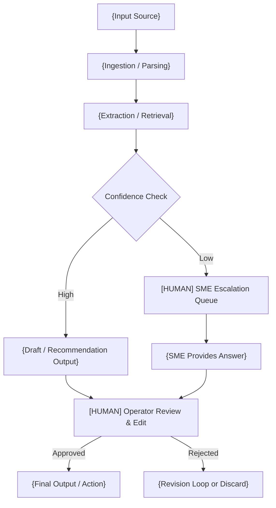

# {Agent Name} — Design Document

> **[TEMPLATE GUIDE]** Replace the title with the agent name and a one-line descriptor (e.g., "Quote / BOM Generation Agent — Design Document"). Remove all `[TEMPLATE GUIDE]` blocks before submitting. Target length: 4–6 pages.
>
> **Input artifacts — populate this template by referencing the following per-task source files:**
> - `task_x_design_intake.md` — client-authored business context, assumptions, requirements, scope exclusions, deliverables (e.g., [task_1_design_intake.md](../../design_exercise_artifacts/task_1_quote_bom_agent/task_1_design_intake.md))
> - `task_x_evaluation.md` — filled evaluation report walking the evaluation strategy; phase-by-phase decisions with confidence and citations (e.g., [task_1_evaluation.md](../../design_exercise_artifacts/task_1_quote_bom_agent/task_1_evaluation.md))
> - `task_x_evaluation.yaml` — structured-output sibling of the evaluation report; canonical machine-readable values for each phase (e.g., [task_1_evaluation.yaml](../../design_exercise_artifacts/task_1_quote_bom_agent/task_1_evaluation.yaml))
>
> Each section below lists a **Sources** block naming the specific fields in those artifacts that should populate it. Fields not listed in Sources (architecture diagram, prompt design, structured output schema, cost/latency estimates, etc.) require the human AI architect's design judgment — those sections remain in the template intentionally even when the intake/evaluation files cannot fully populate them. The evaluation strategy template at [evaluation_strategy.md](../.strategies/evaluation_strategy.md) defines the possible values referenced below.
>
> **Before writing — answer these three questions first:**
> 1. Does a prompt-only baseline fail this use case, and why? If not, stop here — the simpler solution ships.
> 2. Does this require RAG (proprietary/current knowledge), agents (action-taking), or both? Be specific about what forces the complexity.
> 3. Does the company or client already have a managed enterprise search platform (e.g., Glean, Elastic, Copilot) with an API or MCP connection? If yes, that replaces the retrieval pipeline — note it in Assumptions and reduce scope accordingly.
>
> Answers to questions 2 and 3 should already be informed by `task_x_evaluation.yaml`: `phase_3_architecture.selected_tier` (1=prompt-only, 2=RAG, 3=agent) and `phase_2_infrastructure.enterprise_search.exists`.

## Revision History

| Version | Date         | Author   | Notes         |
| ------- | ------------ | -------- | ------------- |
| 0.1     | {YYYY-MM-DD} | {Author} | Initial draft |

---

## 1. Problem Framing
> This section is used to capture the initial business requirements defined by the stakeholders prior to transformation into assessment variables leveraged for AI/Agent evaluation.

> **[TEMPLATE GUIDE]** 3–5 sentences max. What is the business pain today? Who bears it? Why does it matter? What does a successful system change? Avoid restating the task description — reframe it in your own words to show you understood the root problem, not just the ask.
>
> **Sources:**
> - **Current state:** `task_x_design_intake.md` → Context section; `task_x_evaluation.yaml` → `phase_1_problem.use_case_statement.current_workflow` and `.situation`
> - **Desired outcome:** `task_x_design_intake.md` → Requirements + Proposed Deliverables; `task_x_evaluation.yaml` → `phase_1_problem.use_case_statement.motivation` and `.outcome`
> - **Success signal:** `task_x_evaluation.yaml` → `phase_1_problem.success_criteria.{quality,adoption,escalation}`. If these are UNKNOWN in the evaluation, propose 1–2 measurable indicators here and flag them in §3 Assumptions as needing client confirmation.

**Current state:** {Describe what operators do manually today and why it is slow, error-prone, or costly.}

**Desired outcome:** {One sentence on what the agent enables that was not possible before.}

**Success signal:** {How would you know in 90 days that this is working? Name 1–2 measurable indicators.}

---

## 2. Scope

> **[TEMPLATE GUIDE]** Be explicit. Anything not listed in "In Scope" is implicitly out. Reviewers will push on boundaries — own the line you drew and be ready to defend it.
>
> Ask yourself: *What is the simplest architecture that passes the eval for this problem?* If the answer is "prompt-only," that is your v1. RAG, agents, and fine-tuning are earned by proving the simpler approach fails — document that proof here or in Assumptions.
>
> **Sources:**
> - **In Scope:** `task_x_design_intake.md` → Requirements + Proposed Deliverables; `task_x_evaluation.yaml` → `phase_4_canvas.instructions_and_behavior.scope` (positive side) and `phase_4_canvas.architecture_components.components[]`
> - **Out of Scope:** `task_x_design_intake.md` → Scope Exclusions section; `task_x_evaluation.yaml` → `phase_4_canvas.instructions_and_behavior.scope` (exclusions)

### In Scope

- {Feature or capability included in v1}
- {Feature or capability included in v1}
- {Feature or capability included in v1}

### Out of Scope

- {Capability explicitly excluded — state why if non-obvious}
- {Capability explicitly excluded}
- {Capability explicitly excluded}

---

## 3. Assumptions & Constraints

> **[TEMPLATE GUIDE]** Number your assumptions. Each one is a risk — if it is wrong, part of the design breaks. Flag any that are especially load-bearing. Constraints are things you cannot change (technology choices, data availability, compliance); assumptions are things you are treating as true but have not verified.
>
> **Sources:**
> - **Assumptions:** `task_x_design_intake.md` → Assumptions section (carry forward verbatim or paraphrased); `task_x_evaluation.yaml` → any field with `confidence: INFERRED` is an implicit assumption and should be listed here; `task_x_evaluation.md` → Appendix: Open Items (every UNKNOWN that the design depends on becomes a load-bearing assumption until resolved)
> - **Constraints:** `task_x_evaluation.yaml` → `phase_6_governance.constraints.{data_residency,air_gap,regulated_data}` and `phase_6_governance.deployment.model`; technology stack constraints come from project-wide standards (Python/Angular/Postgres/Claude/Jinja2) not the per-task files

### Assumptions

1. {Assumption — e.g., "Catalog data is available in structured CSV or JSON format; no real-time API integration is required for v1."}
2. {Assumption}
3. {Assumption}
4. {Assumption — flag load-bearing ones: **[LOAD-BEARING]** If false, the retrieval strategy changes significantly.}

### Constraints

- **Technology:** Python backend, Angular/Syncfusion frontend, PostgreSQL + pgvector, Anthropic Claude, Jinja2 for templating.
- **Data:** Synthetic or fictional data only. No real customer, pricing, or vendor data.
- **Autonomy:** The agent does not take irreversible actions without human approval. No auto-send, auto-commit, or auto-submit.
- {Additional constraint specific to this task}

---

## 4. Architecture Overview

> **[TEMPLATE GUIDE]** One Mermaid flowchart. Show: data inputs → agent processing steps → human checkpoint(s) → output. Keep it readable — 8–12 nodes max. Explicitly mark human decision points. Do not try to show everything; show the happy path with one escalation branch.
>
> **Sources (partial — diagram requires architect design):**
> - **Input source(s):** `task_x_evaluation.yaml` → `phase_4_canvas.knowledge_and_data.sources[]`
> - **Orchestration pattern** (single_agent / orchestrator_subagents / pipeline): `task_x_evaluation.yaml` → `phase_4_canvas.flows_and_orchestration.pattern`
> - **Tool/action nodes:** `task_x_evaluation.yaml` → `phase_4_canvas.tools_and_integrations.tools[]`
> - **Human checkpoint nodes:** `task_x_evaluation.yaml` → `phase_6_governance.human_gates[]` (any gate with `requires_approval: true` becomes a `[HUMAN]` node)
> - **Output artifact:** `task_x_design_intake.md` → Proposed Deliverables; `task_x_evaluation.yaml` → `phase_4_canvas.instructions_and_behavior.format`
> - The flowchart structure itself, escalation branches, and confidence-gating logic are the architect's design — the source files supply nodes and edges, not the topology.



> **[TEMPLATE GUIDE]** Replace each `{placeholder}` with system-specific names. The `[HUMAN]` label on nodes is intentional — keep it to make checkpoints visible to reviewers.

### Component Inventory

> **Sources:** `task_x_evaluation.yaml` → `phase_4_canvas.architecture_components.components[]` lists named components with `new_or_existing` and notes. The technology column is filled from the project stack defaults unless the evaluation indicates otherwise. The Role column is paraphrased from each component's `notes`.

| Component        | Technology           | Role                                                            |
| ---------------- | -------------------- | --------------------------------------------------------------- |
| Ingestion        | Python / FastAPI     | {Receives and parses input}                                     |
| Storage          | PostgreSQL           | {Stores structured records, audit log}                          |
| Vector Store     | pgvector             | {Stores embeddings for retrieval — include only if RAG is used} |
| AI Reasoning     | Claude (Anthropic)   | {Classification, extraction, draft generation}                  |
| Output Rendering | Jinja2               | {Formats report, email draft, or structured output}             |
| Review UI        | Angular / Syncfusion | {Operator review, edit, approval workflow}                      |

---

## 5. Data Flow

> **[TEMPLATE GUIDE]** Describe data movement end-to-end. Use a sequence diagram if there are meaningful handoffs between systems; otherwise a table of data sources followed by a numbered pipeline is enough. Include: what data enters, how it is transformed, where it is stored, what the agent reads at each step.

### Data Sources

> **Sources:** `task_x_evaluation.yaml` → `phase_4_canvas.knowledge_and_data.sources[]` provides Source name, Format, update frequency, and owner. The Type column (Synthetic/External/Internal) is inferred from the intake's Assumptions (e.g., "synthetic / PoC-generated" maps to Synthetic).

| Source        | Type                              | Format              | Notes                    |
| ------------- | --------------------------------- | ------------------- | ------------------------ |
| {Source name} | {Synthetic / External / Internal} | {JSON / CSV / Text} | {Key fields, known gaps} |
| {Source name} |                                   |                     |                          |

### Processing Pipeline

> **[TEMPLATE GUIDE]** Write this as a numbered flow. Keep business rules inline (TM11-style) so the reader stays in one linear story. Flag any step where bad data causes downstream failure.
>
> **Sources (partial — pipeline narrative is architect-authored):**
> - **Ingest:** `task_x_evaluation.yaml` → `phase_4_canvas.use_case_and_triggers.{triggers,channels}` and `phase_4_canvas.knowledge_and_data.sources[]` (per-session input source)
> - **Parse / Extract schema:** `task_x_evaluation.yaml` → `phase_4_canvas.knowledge_and_data.sources[]` format fields drive the Pydantic stub shape
> - **Retrieve (if RAG):** `task_x_evaluation.yaml` → `phase_4_canvas.knowledge_and_data.ingestion_approach` (managed / oss_managed / diy / NA), `.chunking_strategy`, `.metadata_schema.*`. If `chunking_strategy` is UNKNOWN, the architect specifies it here.
> - **Reason / Score:** `task_x_evaluation.yaml` → `phase_4_canvas.instructions_and_behavior.{role,format,citation,abstention,scope}` populate the prompt contract; the prompt structure itself is the architect's design (see §6 Prompt Design)
> - **Assemble Output:** `task_x_design_intake.md` → Proposed Deliverables; `task_x_evaluation.yaml` → `phase_4_canvas.instructions_and_behavior.format`
> - **Stage for Review:** `task_x_evaluation.yaml` → `phase_6_governance.human_gates[]`

1. **Ingest:** {Describe how input arrives and is validated. What is rejected at intake?}

2. **Parse / Extract:** {How is raw input converted to structured data? What schema does it produce? Show a Pydantic model stub if helpful.}

3. **Retrieve (if RAG):** {Describe chunking strategy — chunk by semantic unit, not arbitrary size; different document types (policy, meeting notes, product specs) should be chunked differently. State the embedding model. State the similarity threshold and what happens when no chunk clears it. State top-k. Specify whether retrieval is pure vector, keyword, or hybrid — use hybrid when users may query with exact terms (names, codes, identifiers) alongside paraphrased concepts. Describe how conflicting sources are handled — surface both, do not resolve silently.}
   - **Metadata requirements:** {What metadata is attached to each chunk? e.g., source document, document type, date, approval status, scope/jurisdiction. Metadata enables filtering before retrieval — define what filters the retriever applies so the model never sees out-of-scope or stale content.}

4. **Reason / Score:** {What does Claude receive as context? Describe the prompt structure: stable instructions (role, format, citation rules, abstention behavior) come first for cache efficiency; dynamic content (retrieved chunks, user input) follows. State explicitly what the model should do when evidence is weak or absent — abstention behavior must be defined, not left implicit. What structured output is expected?}

5. **Assemble Output:** {How is the agent's output assembled into the final artifact — BOM line items, draft text, alert payload, etc.?}

6. **Stage for Review:** {Output lands in operator review queue. Record is persisted. Confidence and evidence are surfaced.}

---

## 6. Agent Decision Logic

> **[TEMPLATE GUIDE]** This is the core section. Show how the agent reasons — not just that it does. Cover: what signals drive the decision, how confidence is scored, what the structured output looks like, and where Claude's role ends and deterministic logic takes over. Avoid hiding all logic in prompts.
>
> **Sources (partial — most decision logic is architect-authored):**
> - **Decision signals:** `task_x_design_intake.md` → Requirements section enumerates evaluation dimensions (e.g., availability, lead time, margin); `task_x_evaluation.yaml` → `phase_1_problem.is_ai_right_tool.gate_human_judgment` indicates which judgments require Claude vs. deterministic logic
> - **Abstention behavior:** `task_x_evaluation.yaml` → `phase_4_canvas.instructions_and_behavior.abstention` and `phase_5_evaluation.abstention_behavior.{no_sources,low_confidence,conflict,out_of_scope}`
> - **Output format:** `task_x_evaluation.yaml` → `phase_4_canvas.instructions_and_behavior.format` and `.citation`
> - Confidence thresholds, scoring weights, prompt-cache structure, and the Pydantic schema body are architect-authored.

### Scoring / Classification Rules

> **[TEMPLATE GUIDE]** Describe the logic that determines output routing, priority, or recommendation. Where possible, express rules deterministically (SQL, Python conditions) and reserve Claude for tasks that genuinely require language understanding. Example table:

| Signal        | Weight / Rule    | Source        | Notes                |
| ------------- | ---------------- | ------------- | -------------------- |
| {Signal name} | {Rule or weight} | {Data source} | {Edge case to watch} |
| {Signal name} |                  |               |                      |

### Confidence Scoring

> **[TEMPLATE GUIDE]** Define what "confidence" means in this context. How is it calculated? What are the thresholds for auto-draft vs. escalate vs. block?

| Confidence Level | Threshold | System Behavior                                     |
| ---------------- | --------- | --------------------------------------------------- |
| High             | {≥ X%}    | Proceed to operator review queue                    |
| Medium           | {X–Y%}    | Flag for review; include uncertainty note in output |
| Low              | {< Y%}    | Route to SME escalation; do not draft               |

### Prompt Design

> **[TEMPLATE GUIDE]** Describe the prompt structure. Adding RAG does not reduce the importance of prompt engineering — it raises the stakes. Call out:
> - What stable instructions appear first (role, output format, citation rules, abstention behavior) — these stay fixed for cache efficiency
> - What dynamic content follows (retrieved chunks, user input)
> - How the model is instructed to behave when sources are weak: it must say so explicitly, not guess
> - Output length bounds — the model should not elaborate beyond what the evidence supports

| Prompt Element           | Position       | Notes                                       |
| ------------------------ | -------------- | ------------------------------------------- |
| Role + task instructions | First (stable) | Cached; define abstention behavior here     |
| Citation / format rules  | First (stable) | How should sources be referenced in output? |
| Retrieved context        | Dynamic        | Top-k chunks; include source metadata       |
| User input / query       | Last (dynamic) |                                             |

### Structured Output Schema

> **[TEMPLATE GUIDE]** Show a Pydantic model or JSON schema for the agent's output. This forces precision about what the agent actually produces and prevents hand-wavy descriptions. Use synthetic field names.

```python
from pydantic import BaseModel
from typing import Optional, List

class AgentOutput(BaseModel):
    # [TEMPLATE GUIDE] Replace with fields appropriate to this agent's output.
    id: str
    confidence_score: float          # 0.0 – 1.0
    recommendation: str              # Primary output text or structured recommendation
    evidence: List[str]              # Supporting citations or data points shown to operator
    requires_human_review: bool      # True if confidence < threshold or edge case flagged
    escalation_reason: Optional[str] # Populated when requires_human_review is True
```

---

## 7. Human Checkpoints

> **[TEMPLATE GUIDE]** MANDATORY. Every workflow must show where humans are in the loop. Be specific: what does the operator see, what can they edit, what happens if they do nothing. Reviewers will probe this section hard.
>
> **Sources:**
> - **Checkpoint rows:** `task_x_evaluation.yaml` → `phase_6_governance.human_gates[]` — each gate becomes a row (use `action` as the checkpoint name, `gate` describes the trigger and human action, `risk_level` informs the timeout behavior column)
> - **SME Escalation row:** carries over from `phase_5_evaluation.abstention_behavior.{no_sources,low_confidence,conflict}`
> - **Accountability bullets:** `task_x_evaluation.yaml` → `phase_6_governance.human_gates[]` whose action is customer-facing or financially impactful; `task_x_design_intake.md` → Requirements (look for "user provides explicit access" / "user reviews" language)

| Checkpoint        | Trigger                                      | What the Human Sees              | Human Action                       | If No Action Taken                                             |
| ----------------- | -------------------------------------------- | -------------------------------- | ---------------------------------- | -------------------------------------------------------------- |
| {Checkpoint name} | {When does this occur?}                      | {Output + evidence + confidence} | Approve / Edit / Reject / Escalate | {Timeout behavior — queue stays open, notified again, expires} |
| SME Escalation    | Confidence below threshold or missing source | Flagged question + gap summary   | Answer directly or provide source  | Queue stays open; output not released                          |

### What Humans Remain Accountable For

- **Final approval** of all customer-facing or financially impactful outputs
- **Override capability** on any agent recommendation
- **Escalation decisions** when agent is uncertain
- {Additional accountability specific to this workflow}

---

## 8. Failure Modes

> **[TEMPLATE GUIDE]** Required by the exercise. Be honest and specific. The categories below map to how the exercise evaluates failure reasoning: retrieval/extraction failures, confidence failures, and financial/reputational risk scenarios. "I don't know" is a valid and important outcome — design for it explicitly.
>
> **Sources:**
> - **Failure mode rows:** `task_x_evaluation.yaml` → `phase_5_evaluation.abstention_behavior.{no_sources,low_confidence,conflict,out_of_scope}` populate the first four rows (missing source, low-confidence extraction, conflicting sources, out-of-scope). Stale data row is informed by `phase_4_canvas.knowledge_and_data.curation.updates` and metadata `date` requirement.
> - **Domain-specific failure:** identify from `task_x_evaluation.md` → Appendix: Open Items (any UNKNOWN with operational impact)
> - **"I Don't Know" cases:** `task_x_evaluation.yaml` → `phase_4_canvas.instructions_and_behavior.abstention` + `phase_5_evaluation.abstention_behavior.*`
> - **Financial/reputational risks:** inferred from `task_x_evaluation.yaml` → `phase_6_governance.human_gates[]` (each high-risk gate implies a financial/reputational scenario); architect adds magnitude and design-protection columns

| Failure Mode                        | Trigger                                           | System Response                                            | Human Action Required                        |
| ----------------------------------- | ------------------------------------------------- | ---------------------------------------------------------- | -------------------------------------------- |
| Missing source / no retrieval match | Query returns no relevant chunks                  | Route to SME; do not draft                                 | SME provides answer or marks unanswerable    |
| Conflicting sources                 | Two sources give different answers                | Surface both; flag conflict; do not resolve automatically  | Operator or SME selects authoritative source |
| Low-confidence extraction           | Structured parse fails or yields ambiguous output | Return partial result with gap markers; do not hallucinate | Operator fills gaps manually                 |
| Stale data                          | Input source outdated beyond threshold            | Warn operator; surface data freshness indicator            | Operator decides whether to proceed          |
| {Domain-specific failure}           | {Trigger}                                         | {Response}                                                 | {Human action}                               |

### "I Don't Know" Cases

> **[TEMPLATE GUIDE]** Explicitly list scenarios where the agent should refuse to answer or draft. This is as important as what the agent does answer.

- {Scenario where evidence is insufficient — agent says nothing and escalates}
- {Scenario where sources conflict without resolution — agent flags, does not pick}
- {Scenario where the question is out of domain — agent rejects cleanly}

### Unsupported Answer Rate

> **[TEMPLATE GUIDE]** Define hallucination operationally — not philosophically. The measurable definition: **unsupported answer rate** = the percentage of outputs that cannot be verified against the retrieved, approved source evidence by a human evaluator. State how this will be measured (spot-check cadence, eval set, automated source-grounding verification) and what threshold triggers a review of the retrieval or prompt configuration.

### Financial / Reputational Risk Scenarios

> **[TEMPLATE GUIDE]** What would cost money or damage a relationship if the agent produced a wrong output? Name the scenario, the magnitude, and the design protection.

| Risk Scenario                       | Potential Impact           | Design Protection                       |
| ----------------------------------- | -------------------------- | --------------------------------------- |
| {E.g., wrong margin recommendation} | {Revenue loss}             | {Human approval gate before any action} |
| {E.g., wrong RFP answer submitted}  | {Legal / credibility risk} | {Draft-only output; no auto-submit}     |

---

## 9. Governance & Security

> **[TEMPLATE GUIDE]** Keep this short. Cover: what data is persisted, who can see it, how outputs are audited, any compliance considerations. Don't invent requirements — note what is UNKNOWN or needs SME input.
>
> **Deployment choice:** State which deployment model applies and why — Raw API (fastest iteration, fewest controls), Managed cloud (enterprise default: private networking, data residency, observability), or Self-hosted (required only when sovereignty or air-gap is a hard constraint). If the environment is regulated, note whether zero-retention or application-state settings are available from the provider.
>
> **Security — prompt injection:** Treat it as a first-class injection risk. Retrieved content must never become system instructions. Tool surfaces must be least-privilege. Validate inputs; check outputs before returning them. Note any sensitive fields that should be redacted before entering the retrieval pipeline.
>
> **Sources:**
> - **Deployment choice:** `task_x_evaluation.yaml` → `phase_6_governance.deployment.{model,rationale}` (raw_api / managed_cloud / self_hosted); if UNKNOWN, derive from `phase_6_governance.constraints.{data_residency,air_gap,regulated_data}`
> - **Data handling / PII review:** `task_x_evaluation.yaml` → `phase_6_governance.constraints.regulated_data` and `phase_6_governance.security.redaction`
> - **Security strategy:** `task_x_evaluation.yaml` → `phase_6_governance.security.{prompt_injection,least_privilege,redaction}` — least-privilege is also visible in `phase_4_canvas.tools_and_integrations.tools[]` (action_type, reversible, requires_approval)
> - **Access control / roles:** inferred from `task_x_evaluation.yaml` → `phase_6_governance.human_gates[]` (action ownership) and `task_x_design_intake.md` Assumptions (e.g., who is the "user"). Identity/auth specifics typically appear as UNKNOWN — carry forward from `phase_2_infrastructure.tooling.identity`.

### Data Handling

- All inputs and outputs are persisted to PostgreSQL with timestamps and user attribution.
- Synthetic data only in this prototype; real deployment would require {PII handling / data classification review — **REQUIRES SME INPUT**}.

### Audit Trail

- Every agent run creates an immutable log record: input hash, model used, output, confidence score, human decision, timestamp.
- Log retention policy: **TODO — confirm with compliance.**

### Access Control

- {Role that can trigger the agent}
- {Role that can view outputs in the review queue}
- {Role that can approve / override}

---

## 10. Cost & Latency

> **[TEMPLATE GUIDE]** Be honest about estimates. Use order-of-magnitude reasoning. Reviewers want to see that you thought about this, not that you have precise numbers. Note what drives cost up (long contexts, many retrievals) and what you would do if cost were 10× higher than expected.
>
> Set explicit service targets before filling in the table: time to first token, p95 end-to-end latency, error rate, and token burn per request. If you cannot hit targets, name which of the three levers you would pull: (1) minimize tokens — shorter prompts, smaller retrieved context, bounded output; (2) reduce model calls — combine steps, avoid redundant calls; (3) route by task — use a smaller/faster model for low-risk steps, stronger model only where reasoning quality changes the outcome.
>
> **Sources (partial — most numbers are architect-estimated):**
> - **Operations rows:** derive from `task_x_evaluation.yaml` → `phase_4_canvas.tools_and_integrations.tools[]` and `phase_4_canvas.flows_and_orchestration.pattern` (a `single_agent` pattern implies one to a few model calls; `orchestrator_subagents` multiplies the row count)
> - **Context size assumptions:** informed by `phase_4_canvas.knowledge_and_data.sources[]` size hints and `.chunking_strategy`
> - Latency/cost numbers, service targets, and cost-control measures are architect-estimated unless the intake or evaluation explicitly states a target.

| Operation                     | Model / Service   | Est. Latency | Est. Cost / Run | Notes                       |
| ----------------------------- | ----------------- | ------------ | --------------- | --------------------------- |
| {Extraction / classification} | Claude Sonnet 4.6 | {~Xs}        | {~$X/run}       | {Context size assumption}   |
| {RAG retrieval}               | pgvector          | {~Xs}        | {Negligible}    | {N chunks at K tokens each} |
| {Draft generation}            | Claude Sonnet 4.6 | {~Xs}        | {~$X/run}       | {Output token estimate}     |
| **Total per workflow run**    |                   | **{~Xs}**    | **{~$X}**       |                             |

### Service Targets

| Indicator              | Target      | Notes                              |
| ---------------------- | ----------- | ---------------------------------- |
| Time to first token    | {~Xs}       |                                    |
| p95 end-to-end latency | {~Xs}       |                                    |
| Token burn per request | {~N tokens} | Prompt + context + output estimate |
| Error rate             | {< X%}      |                                    |

### Cost Control Measures

- {Use prompt caching for repeated context — stable instructions and static knowledge at prompt prefix}
- {Batch low-urgency jobs overnight}
- {Set token limits on output; truncate excess retrieved context before the model call}
- {Route narrow low-risk steps to a smaller/faster model; reserve full reasoning for steps where quality changes the outcome}

---

## 11. Future Improvements

> **[TEMPLATE GUIDE]** Explicitly out of scope for v1. Capture here to keep the scope clean and show the reviewer you know what you are deferring. Short bullet list — no design detail needed.
>
> **Sources:**
> - `task_x_design_intake.md` → Scope Exclusions (items the client called out as deferred, not killed)
> - `task_x_evaluation.md` → Appendix: Open Items (UNKNOWNs that the architect chose to defer rather than resolve in v1)
> - `task_x_evaluation.yaml` → `phase_4_canvas.architecture_components.components[]` with notes mentioning "future" or "post-PoC"

- {Improvement deferred from v1 — e.g., "Real-time distributor API integration to replace static catalog"}
- {Improvement deferred — e.g., "Fine-tuning or few-shot optimization based on operator correction history"}
- {Improvement deferred — e.g., "Multi-language support"}
- {Improvement deferred — e.g., "Direct CRM / ERP write-back once human approval workflow is proven"}

---

## 12. Rollout & Versioning

> **[TEMPLATE GUIDE]** Nothing should go straight from development to full traffic. Treat prompts, eval sets, retrieval configuration, and model version as versioned artifacts — a bad prompt change should be as recoverable as a bad code deploy.
>
> Define a rollback trigger before deploying: what would you observe in the first hour that tells you something has regressed? Business-critical metrics matter more than technical ones here.
>
> **Sources:**
> - **Versioned artifacts table:** `task_x_evaluation.yaml` → `phase_7_rollout.artifacts.{system_prompt,retrieval_config,model_version,tool_definitions}` (`versioned` and `requires_eval` flags). These are typically UNKNOWN in the evaluation — propose defaults here.
> - **Rollback trigger:** `task_x_evaluation.yaml` → `phase_7_rollout.rollback_trigger`; if UNKNOWN, derive from `phase_1_problem.success_criteria.*` (a regression below the success target is the natural trigger)
> - **Regression suite cases:** `task_x_evaluation.md` → Appendix: Open Items (each known edge case becomes a regression test) and `phase_5_evaluation.abstention_behavior.*` (each abstention scenario should be in the regression set)

| Artifact                                   | Versioned? | Rollback Mechanism                        |
| ------------------------------------------ | ---------- | ----------------------------------------- |
| Prompt templates                           | {Yes / No} | {e.g., config file pinned to version tag} |
| Retrieval configuration (top-k, threshold) | {Yes / No} |                                           |
| Eval / regression set                      | {Yes / No} |                                           |
| Model version                              | {Yes / No} |                                           |

### Promotion Strategy

- **Canary:** {What percentage of traffic or users see the new version first?}
- **Rollback trigger:** {What metric or observation causes an immediate revert?}
- **Regression suite:** {What known hard cases are tested on every change — edge cases, prior failures, domain-specific jargon?}

---

## Appendix A — Synthetic Data Schema (Optional)

> **[TEMPLATE GUIDE]** Include if your design references a specific data structure that needs to be concrete. A 5–10 row synthetic dataset or a schema stub is enough. Required for tasks where the agent output depends on a well-defined input shape (e.g., Task 1 catalog records, Task 3 renewal records).
>
> **Sources:**
> - **Schema scaffold:** `task_x_design_intake.md` → Assumptions (data format, fields, date semantics)
> - **Required fields:** `task_x_evaluation.yaml` → `phase_4_canvas.knowledge_and_data.metadata_schema.*` flags which metadata fields are required (source, date, approval, scope)

```python
# Example synthetic record — replace with fields relevant to this agent
{
  "id": "REC-001",
  "field_a": "...",
  "field_b": 0.0,
  "status": "active",
  "created_at": "2026-01-15"
}
```

---

## Appendix B — Key Design Decisions (Optional)

> **[TEMPLATE GUIDE]** Include only if you made a non-obvious choice that a reviewer might question. One row per decision. This is the place to pre-empt "why didn't you just…?" questions.
>
> **Sources:**
> - `task_x_evaluation.md` → Appendix: Decision Summary lists architecture tier, ingestion approach, orchestration pattern, deployment model, and rollback trigger with rationale — promote any non-obvious entry into this table
> - Any field in `task_x_evaluation.yaml` with `confidence: INFERRED` paired with a concrete value is a candidate decision row (the architect chose despite the absence of explicit client guidance)

| Decision        | Alternatives Considered | Rationale                                                        |
| --------------- | ----------------------- | ---------------------------------------------------------------- |
| {Decision made} | {Option A, Option B}    | {Why this option — usually: simpler, safer, or more explainable} |
