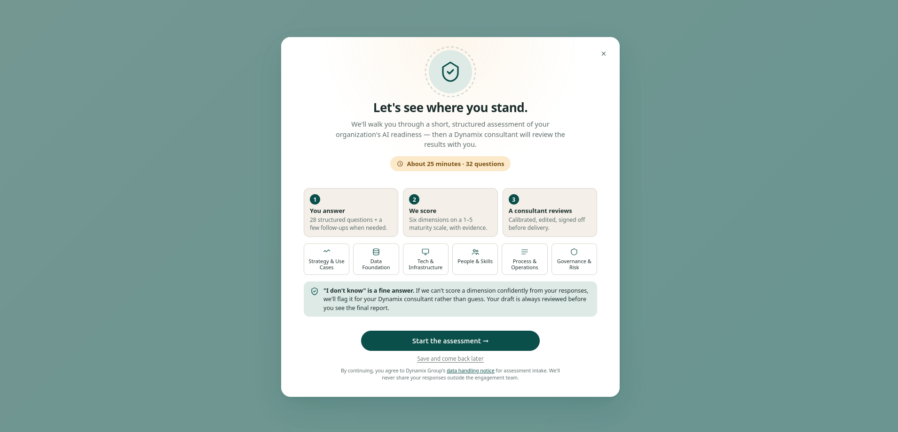
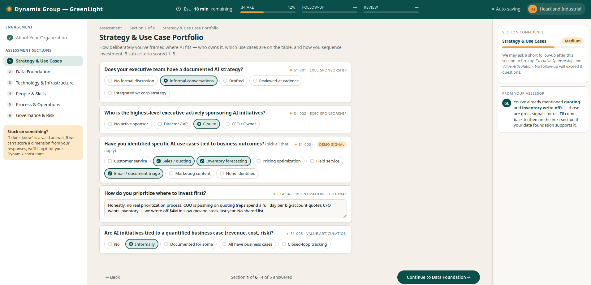
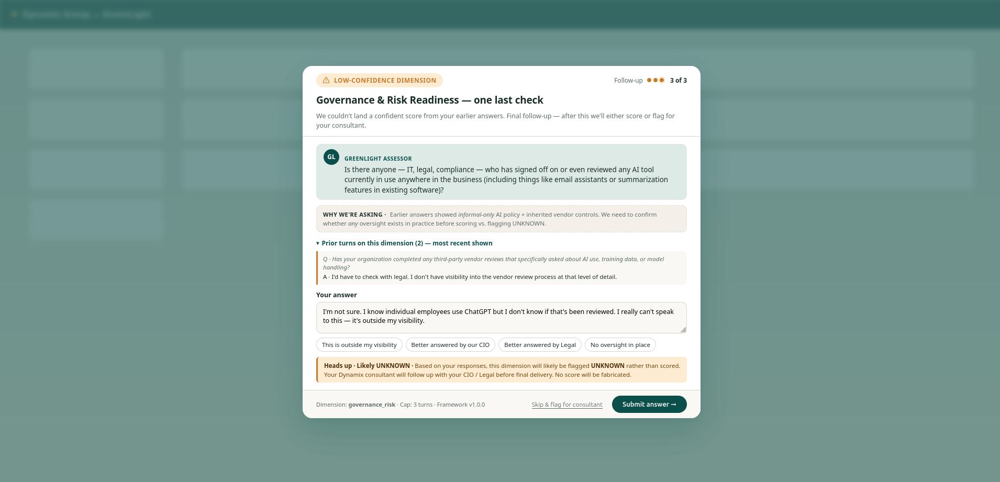

# GreenLight — AI Readiness Assessment Discovery Agent

## Overview

GreenLight is my take on the **Task 4 — AI Readiness Assessment**

In the design spec [GreenLight.md](GreenLight.md) I emphasize how the client experience will be one of the most important factors with an automated assessment, while still providing details on the technical aspects of the agent. See some of my mockups below:

  <b>Activation</b> — client kickoff and consent 
  

  <b>Dimension Intake</b> — guided per-dimension interview 
  

  <b>Last Check</b> — review before consultant handoff 
  

## Repository Structure

| Path                           | Description                                                                                                                                                                           |
| ------------------------------ | ------------------------------------------------------------------------------------------------------------------------------------------------------------------------------------- |
| [GreenLight.md](GreenLight.md) | Full design specification — architecture, interview-state machine, scoring framework, completeness gate, failure modes, governance, and cost/latency estimates.                       |
| [assets](assets)               | Configuration and data the agent operates on: `framework_config.yaml` (six-dimension scoring framework), `intake_schema.json` (question structure), and synthetic interview fixtures. |
| [mockups](mockups)             | Static image mockups of the client-facing assessment surfaces (activation, dimension intake, final check).                                                                            |
| [html_mockups](html_mockups)   | Interactive HTML mockups corresponding to the static mockups, used to validate flow and copy with reviewers.                                                                          |
