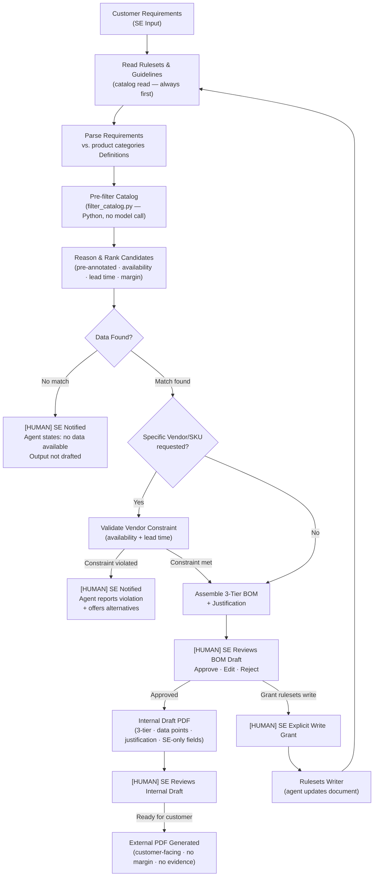

# QuotePilot / BOM Generation Agent — Design Document

## Revision History

| Version | Date       | Author      | Notes                                                                                                                                                      |
| ------- | ---------- | ----------- | ---------------------------------------------------------------------------------------------------------------------------------------------------------- |
| 0.1     | 2026-05-11 | Zach Robida | Initial draft                                                                                                                                              |
| 0.2     | 2026-05-11 | Zach Robida | Add catalog pre-filter script; split BOM template into internal draft and external; structured justification schema; external PDF gated on SE confirmation |

---

## 1. Problem Framing

> This section is used to capture the initial business requirements defined by the stakeholders prior to transformation into assessment variables leveraged for AI/Agent evaluation.

**Current state:** Sales engineers at Dynamix spend significant time manually building Bills of Materials for customer requirements — pulling SKUs across catalogs from 200+ vendors and distributors, validating availability and lead times, calculating margin against vendor cost, and assembling alternative configurations at different price/performance tiers. This manual process is a direct constraint on quote turnaround time, which is a competitive lever the business cannot fully exploit today.

**Desired outcome:** A sales engineer submits a curated customer requirements list and receives a validated, multi-vendor BOM across three price/performance tiers — with SKU-level data points and justification — without manually querying vendor catalogs or applying evaluation rules by hand.

**Success signal:** (1) Reduction in quote turnaround time relative to the manual baseline. (2) Supported answer rate ≥ 90%: the percentage of BOM line items that a sales engineer can trace directly to a catalog entry and a ruleset clause without needing to validate from scratch.

---

## 2. Scope

> A prompt-only baseline cannot fulfill this use case: the agent must read a dynamic external rulesets document, query a structured catalog across multiple dimensions, and conditionally write back to that rulesets document. These multi-step, stateful, tool-calling requirements place the design firmly at Tier 3 (Agent). No enterprise search platform exists; the catalog is a bespoke Python-generated JSON file.

### In Scope

- Conversion of a curated sales engineer requirements list into a 3-tier (budget / balanced / premium) multi-vendor BOM
- Evaluation of vendor catalog entries against availability, lead time, and margin using SE-maintained rulesets & guidelines
- Support for specific vendor or SKU requests, with availability and lead-time validation; constraint-violation reporting and alternative suggestions if the request cannot be satisfied
- Rulesets & guidelines document: read before every evaluation; writable only when the SE grants explicit in-session access
- Variable data model: solution must support additional product categories, vendors, and SKUs beyond the PoC set
- BOM output: SKU, vendor, relevant data points, and justification per tier; soft recommendation across tiers
- Data freshness surfacing: catalog last-updated date and per-vendor effective date surfaced alongside BOM output

### Out of Scope

- Full pricing engine — not in v1; requires dedicated pricing service design
- Customer portal UI — explicitly excluded; BOM output is a draft artifact reviewed by the SE, not auto-delivered
- Catalog data management — the agent does not create, update, or delete catalog source data
- SKU-level effective-date tracking — not available in the current catalog data model
- Authentication/ Access Control

---

## 3. Assumptions & Constraints

### Assumptions

1. PoC covers 3–4 representative product categories; the solution architecture must support additional categories without redesign.
2. Catalog data is generated by a Python script (created by Claude) for repeatable synthetic output; no real distributor API is connected in v1.
3. PoC data source is JSON; 50 vendors/distributors, each with multiple product SKUs varied across the defined product categories.
4. A boilerplate BOM template is used for PoC output rendering.
5. The SE produces a curated, feasible requirements list before engaging the agent.
6. Vendors must not vary across a specific product category within a single BOM (cross-vendor mixing is permitted across categories, not within).
7. The rulesets & guidelines document is initially authored by the SE and maintained manually or via prompted agent updates; the agent may modify it only when the SE provides explicit per-session authorization.
8. The interaction channel is limited to CLI/ Claude Code Chat (if working within the repo) for PoC.
9. Working baseline: ≥ 90% supported answer rate; quote turnaround time reduction to be baselined against current manual average. Requires SE/PM confirmation before evaluation harness is built.
10. The fallback behavior when a specific vendor/SKU request cannot be met is assumed to be: report the constraint violation and offer the best available alternatives.
11. No data residency or air-gap requirements have been identified. Managed Cloud (Anthropic API) is assumed.

### Constraints

- **Technology:** Python backend; Anthropic Claude API (claude-sonnet-4-6 for reasoning, claude-haiku-4-5 for lightweight steps); JSON flat-file catalog for PoC; Jinja2 for BOM template rendering.
- **Data:** Synthetic or fictional catalog, ruleset, and requirements data only. No real customer, pricing, or vendor data in this prototype.
- **Autonomy:** The agent does not take irreversible actions without human approval. The rulesets document is the only writable artifact, and writes require explicit SE grant per session. The catalog source is never modified by the agent.

---

## 4. Architecture Overview

> **[ARCHITECT — complete this section]** Replace the placeholder flowchart below once the interaction channel (§3, Assumption 8) is resolved.



### Component Inventory

| Component                      | Technology                                            | New / Existing      | Role                                                                                                                                                                         |
| ------------------------------ | ----------------------------------------------------- | ------------------- | ---------------------------------------------------------------------------------------------------------------------------------------------------------------------------- |
| Core agent (LLM loop)          | Python + Claude (Anthropic)                           | New                 | Reads rulesets, parses requirements, calls tools, assembles BOM                                                                                                              |
| Vendor/distributor catalog     | JSON flat file                                        | New (PoC-generated) | Source of SKUs, availability, lead time, margin across 50 vendors                                                                                                            |
| Catalog data generation script | Python                                                | New                 | Generates repeatable synthetic catalog data for PoC                                                                                                                          |
| Catalog pre-filter script      | Python (`scripts/filter_catalog.py`)                  | New                 | Reads rulesets.yaml for thresholds; hard-excludes rule-005 violations; annotates rule-001/002/003/004 on each candidate; agent reads output instead of catalog.json directly |
| Rulesets & guidelines document | YAML (`assets/rulesets.yaml`)                         | New (SE-authored)   | Encodes lead-time thresholds, availability rules, margin floor, data-freshness threshold; read-only to agent unless SE grants write access per session                       |
| Product category definitions   | JSON (`assets/pc_def.json`)                           | New (SE-authored)   | Maps category identifiers to descriptions and attributes used to translate SE requirements into catalog queries                                                              |
| BOM template — internal draft  | Jinja2 (`templates/bom_template.html.jinja`)          | New                 | Renders 3-tier BOM with full SE fields: user request, evidence, structured justification, soft recommendation, SE review status                                              |
| BOM template — external        | Jinja2 (`templates/bom_template_external.html.jinja`) | New                 | Customer-facing version: omits margin %, effective date, evidence, justification, user request, and SE review language                                                       |
| BOM render script              | Python (`scripts/render_bom.py`)                      | New                 | Injects `BOMOutput` data into the selected template (`--external` flag) and writes the PDF                                                                                   |
| Review interface               | CLI/Claude Code                                       | TBD                 | Channel through which SE submits requirements and reviews BOM draft                                                                                                          |

---

## 5. Data Flow

### Data Sources

| Source                         | Type                      | Format                                  | Notes                                                                                                                                          |
| ------------------------------ | ------------------------- | --------------------------------------- | ---------------------------------------------------------------------------------------------------------------------------------------------- |
| Vendor/distributor catalog     | Synthetic (PoC-generated) | JSON (`assets/catalog.json`)            | 50 vendors × multiple SKUs × 3–4 categories; source-level `last_updated`; per-vendor `effective_date`; no SKU-level effective date             |
| Rulesets & guidelines document | SE-authored               | YAML (`assets/rulesets.yaml`)           | Acceptable lead-time thresholds, availability gate, margin floor, data-freshness threshold; updated manually by SE or via prompted agent write |
| Product category definitions   | SE-authored               | JSON (`assets/pc_def.json`)             | Category identifiers and descriptions used to map SE requirements to catalog queries; read by agent at session start alongside rulesets        |
| Customer requirements input    | Per-session (ephemeral)   | UNKNOWN (natural-language text assumed) | SE-curated; not persisted beyond session unless logged                                                                                         |

### Processing Pipeline

1. **Ingest:** The SE submits a curated requirements list via the agent interface (channel TBD — §3, Assumption 8). The agent confirms at least one recognizable product category is present before proceeding; ambiguous input triggers a clarification request.

2. **Read Rulesets First:** Before any catalog query, the agent reads the rulesets & guidelines document in full, loading category definitions, evaluation thresholds, and any SE-specified vendor priority rules into context. This step is mandatory.

3. **Parse / Extract:** Requirements are parsed against the category definitions to produce a category-keyed specification (e.g., `{networking-switch: {port_count: 48, poe: true}}`). Unresolvable requirements are flagged for SE clarification rather than silently dropped.

4. **Pre-filter Catalog:** `filter_catalog.py` is invoked via Bash before any model reasoning. It reads thresholds live from `rulesets.yaml`, hard-excludes rule-005 violations (null cost or missing margin), and annotates every remaining candidate with the rules that fired (rule-001 through rule-004). The agent reads this output instead of `catalog.json` directly, eliminating in-context rule re-derivation across 150+ SKUs.

5. **Reason / Score:** Claude receives the pre-annotated candidate list + parsed requirements. It selects one SKU per tier per category, writes a structured justification (one `{summary, bullets}` block per tier), and produces a soft cross-tier recommendation. When data is absent or a constraint is violated, Claude states this explicitly — no substitution, no fabrication.

6. **Assemble Output:** The `BOMOutput` JSON is written to `output/`, then rendered to PDF via `render_bom.py`. The internal draft (default) includes all SE fields: evidence, structured justification, soft recommendation, and SE review status. The external version (`--external` flag) strips margin %, effective date, evidence, justification, and SE review language — generated only after the SE confirms they have reviewed the internal draft.

7. **Stage for Review:** Internal draft enters the SE review queue. External PDF is generated on explicit SE confirmation. Neither version is released to customers without SE approval.

---

## 6. Agent Decision Logic

### Scoring / Classification Rules

| Signal             | Rule                                                                                                                 | Source             | Notes                                                                                             |
| ------------------ | -------------------------------------------------------------------------------------------------------------------- | ------------------ | ------------------------------------------------------------------------------------------------- |
| Availability       | Must be `true` — hard filter                                                                                         | Catalog            | Binary; unavailable SKUs excluded from all tiers                                                  |
| Lead time          | Must be ≤ threshold defined in rulesets                                                                              | Rulesets + Catalog | Threshold varies by category; missing values surface a gap marker                                 |
| Margin             | Must meet or exceed minimum margin % from rulesets                                                                   | Rulesets + Catalog | Calculated from unit cost; missing values surface a gap marker                                    |
| Vendor consistency | Single vendor per product category within a BOM                                                                      | Intake requirement | Cross-vendor mixing allowed across categories; enforced deterministically before Claude reasoning |
| Data freshness     | Vendor effective date age vs. rulesets threshold                                                                     | Catalog metadata   | Warning only — SE decides whether to proceed on stale data                                        |
| Tier assignment    | Budget = lowest cost meeting all constraints; Premium = highest performance meeting constraints; Balanced = midpoint | Architect-defined  | Claude assigns tier; deterministic pre-filter handles hard constraints                            |

### Confidence Scoring

| Confidence Level | Threshold                                                                                 | System Behavior                                                                                 |
| ---------------- | ----------------------------------------------------------------------------------------- | ----------------------------------------------------------------------------------------------- |
| High             | All three constraint dimensions (availability, lead time, margin) have clear catalog data | Proceed to 3-tier BOM draft; route to SE review queue                                           |
| Partial          | One or more dimensions missing from catalog entry                                         | Draft BOM with gap markers on affected lines; flag for SE review with explicit uncertainty note |
| None             | No catalog entries meet the parsed requirements in any tier                               | Agent abstains; states no data is available; escalates to SE; no draft generated                |

### Prompt Design

| Prompt Element                      | Position                                     | Notes                                                                                                       |
| ----------------------------------- | -------------------------------------------- | ----------------------------------------------------------------------------------------------------------- |
| Role + task instructions            | First (stable — cached)                      | BOM generation assistant for sales engineers; accuracy-first                                                |
| Output format + citation rules      | First (stable — cached)                      | 3-tier structure; cite catalog entry (vendor ID, SKU, effective date) and ruleset clause for each selection |
| Abstention and scope rules          | First (stable — cached)                      | Out-of-scope topics declined gracefully; no fabrication on missing data                                     |
| Rulesets & guidelines content       | Second (semi-stable — cached when unchanged) | Loaded in full before any catalog evaluation; invalidate cache on SE-granted writes                         |
| Matching catalog entries + metadata | Dynamic                                      | Per-request; filtered catalog entries with freshness metadata                                               |
| Parsed customer requirements        | Last (dynamic)                               | Per-session SE input                                                                                        |

### Structured Output Schema


```python
from pydantic import BaseModel
from typing import Optional, List, Literal, Dict
from typing_extensions import TypedDict

class BOMLineItem(BaseModel):
    tier: Literal["budget", "balanced", "premium"]
    sku: str
    vendor_id: str
    vendor_name: str
    category: str
    availability: bool
    lead_time_days: Optional[int]       # None triggers gap marker
    unit_cost: Optional[float]          # None triggers gap marker
    margin_pct: Optional[float]         # None triggers gap marker
    catalog_effective_date: str         # ISO date string from catalog entry
    evidence: List[str]                 # Catalog entry ref + ruleset clause(s) cited
    gap_markers: List[str]              # Fields missing from catalog — surfaced to SE

class TierJustification(TypedDict):
    summary: str                        # 1–2 sentences: why this SKU for this tier
    bullets: List[str]                  # 3–5 points: cost, lead-time, margin, flags, trade-off

class BOMOutput(BaseModel):
    request_id: str
    user_request: str                   # Verbatim SE prompt
    tiers: List[BOMLineItem]            # One entry per tier per category
    justification: Dict[Literal["budget", "balanced", "premium"], TierJustification]
    soft_recommendation: str            # 2–4 sentences: recommended config + blended cost/margin
    data_freshness_warnings: List[str]  # Vendors whose effective_date exceeds threshold
    requires_human_review: bool         # True if any gap_markers or constraint violations
    abstention_reason: Optional[str]    # Populated when no data is available for a requirement
```

---

## 7. Human Checkpoints

| Checkpoint                        | Trigger                                             | What the Human Sees                                                                                 | Human Action                                                                                            | If No Action Taken                                                 |
| --------------------------------- | --------------------------------------------------- | --------------------------------------------------------------------------------------------------- | ------------------------------------------------------------------------------------------------------- | ------------------------------------------------------------------ |
| BOM Draft Review                  | Agent completes BOM assembly                        | 3-tier BOM draft with SKU, vendor, data points, justification, data freshness warnings, gap markers | Approve (finalize BOM) / Edit (modify line items or tiers) / Reject (discard and resubmit requirements) | BOM remains in draft; not released to customer                     |
| Rulesets Write Authorization      | SE instructs agent to update rulesets & guidelines  | Agent proposes specific change to rulesets document; shows before/after diff                        | Grant write access (agent applies change) / Deny (agent does not write)                                 | Agent does not modify rulesets; current document remains unchanged |
| Constraint Violation Notification | Agent cannot satisfy a specific vendor/SKU request  | Constraint violation summary + best available alternatives from catalog                             | Accept alternatives / Revise requirements / Mark unresolvable                                           | No BOM output released; session waits for SE direction             |
| No-Data Escalation                | No catalog entries match any tier for a requirement | Agent's explicit "no data available" statement + affected requirement(s)                            | Provide an alternative requirement / Mark as out of scope / Close session                               | No BOM output released                                             |

### What Humans Remain Accountable For

- **Rulesets curation** — the SE owns the rulesets & guidelines document; the agent acts only as an editor when explicitly granted
- **Escalation decisions** when the agent abstains or flags missing data
- **Requirements quality** — the SE produces curated, feasible requirements that the agent can act on

---

## 8. Failure Modes

| Failure Mode                                                 | Trigger                                                                        | System Response                                                                        | Human Action Required                                 |
| ------------------------------------------------------------ | ------------------------------------------------------------------------------ | -------------------------------------------------------------------------------------- | ----------------------------------------------------- |
| No catalog data for requirement                              | No entries match any tier for a product category                               | Agent states explicitly: no data available; does not draft; escalates to SE            | SE revises requirement or marks as out of scope       |
| Specific vendor/SKU request unmet                            | Requested vendor not in catalog, or availability/lead-time constraint violated | Agent reports violation; offers best available alternatives from catalog               | SE accepts alternatives or revises request            |
| Conflicting distributor data (same SKU, different lead time) | Two catalog entries disagree on a dimension for the same SKU                   | Surface both entries with source metadata; flag conflict; do not resolve automatically | SE or SME selects the authoritative entry             |
| Partial catalog entry (gap in dimension)                     | Availability, lead time, or cost missing from a catalog entry                  | Return BOM line with gap marker on missing fields; flag for SE review                  | SE fills gap manually or excludes that SKU            |
| Stale data                                                   | Vendor effective date exceeds ruleset freshness threshold                      | Warn SE; surface effective date alongside BOM line; do not suppress the entry          | SE decides whether to accept or exclude stale entries |
| Rulesets write without authorization                         | Agent attempts to modify rulesets document without explicit SE grant           | Write blocked; agent reports that authorization is required                            | SE grants or denies access                            |

### "I Don't Know" Cases

- A customer requirement references a product category not defined in the rulesets product categories list — agent requests SE clarification before querying the catalog; does not guess at the category mapping.


### Financial / Reputational Risk Scenarios

| Risk Scenario                                                  | Potential Impact                                                           | Design Protection                                                                                                                         |
| -------------------------------------------------------------- | -------------------------------------------------------------------------- | ----------------------------------------------------------------------------------------------------------------------------------------- |
| Wrong margin recommendation delivered                          | Dynamix quotes below cost; revenue loss on deal                            | SE reviews and approves all BOM output before customer delivery; margin field is traceable to catalog cost entry                          |
| Fabricated SKU or availability data causes fulfillment failure | Order placed for an unavailable product; relationship and credibility risk | Agent abstains when data is missing; all BOM lines require a catalog citation; gap markers prevent silent fabrication                     |
| Rulesets document corrupted by unauthorized write              | All future evaluations apply wrong thresholds; systemic mispricing risk    | Rulesets write requires explicit SE grant per session; agent shows before/after diff before applying; audit log records every write event |
| Stale catalog data causes incorrect lead-time commitment       | Customer expects delivery date the vendor cannot meet                      | Data freshness warning surfaced on BOM line; SE explicitly accepts or rejects stale entries before approval                               |

---

## 9. Governance & Security

**Deployment:** Managed Cloud via Anthropic API. No data residency constraints or air-gap requirements have been identified. If constraints emerge, self-hosted deployment must be evaluated.

### Data Handling

- Catalog, rulesets, and requirements are local flat files in the PoC. No PII or regulated data identified in vendor product/pricing data.
- Margin data may be commercially sensitive — classification review required before production deployment.
- Synthetic data only in this prototype.

### Access Control

- Sales engineer is the sole user in PoC; no role-based auth defined.

### Security

- **Prompt injection:** Rulesets and catalog content are treated as data context, not instructions. Retrieved content is injected into user/context turns, not the system prompt. Customer requirements are validated (category recognition check) before inclusion in the prompt context.
- **Least privilege:** Catalog reader is read-only; the agent cannot modify catalog data under any condition. Rulesets writer is gated behind explicit per-session SE grant; no auto-write.

---

## 10. Cost & Latency

> Numbers below are order-of-magnitude estimates for a single agent session against the PoC catalog (50 vendors, 3–4 categories). Calibrate against actual token counts once the catalog schema and rulesets document are finalized.

| Operation                            | Model / Service        | Est. Latency | Est. Cost / Run | Notes                                                                                      |
| ------------------------------------ | ---------------------- | ------------ | --------------- | ------------------------------------------------------------------------------------------ |
| Rulesets + category definitions read | claude-haiku-4-5       | ~1–2s        | ~$0.0005        | ~3K token context (rulesets + pc_def + requirements)                                       |
| Catalog pre-filter                   | Python (no model call) | ~0.1s        | Negligible      | `filter_catalog.py` — dict scan + rule annotation; eliminates in-context rule derivation   |
| BOM reasoning + justification draft  | claude-sonnet-4-6      | ~5–10s       | ~$0.01–0.02     | Pre-annotated candidates + requirements; output includes structured justification per tier |
| BOM template rendering (×2)          | Jinja2 + WeasyPrint    | ~1–3s        | Negligible      | Internal draft always; external on SE confirmation                                         |
| **Total per session**                |                        | **~7–15s**   | **~$0.01–0.02** | Single-turn PoC; multi-turn (rulesets write loop) adds one extra reasoning call            |

### Service Targets

| Indicator              | Target      | Notes                                                                 |
| ---------------------- | ----------- | --------------------------------------------------------------------- |
| Time to first token    | ~2s         | Haiku for parse step returns quickly; Sonnet reasoning step dominates |
| p95 end-to-end latency | ~15s        | Includes rulesets read, catalog query, BOM reasoning, template render |
| Token burn per session | ~20K tokens | Prompt + semi-stable rulesets (cached) + filtered catalog + output    |
| Error rate             | < 5%        | API errors and malformed output combined                              |

### Cost Control Measures

- System prompt and rulesets content sit at the prompt prefix for caching; rulesets cache invalidates only on SE-granted writes.
- Catalog is queried as structured data — no embeddings, no vector store, no per-query model call for retrieval (primary saving vs. RAG).
- Haiku handles the parse step; Sonnet is reserved for BOM reasoning and justification.
- Output length is bounded by the BOM template (3 tiers × fixed fields + justification); prompt instructs Claude not to elaborate beyond catalog evidence.
- Catalog pre-filter (`filter_catalog.py`) runs before the model call, passing only rule-annotated candidates; eliminates per-SKU rule re-derivation in the model.

---

## 11. Future Improvements

- Real-time distributor API integration to replace the static JSON catalog (enables live availability and lead-time data)
- Contract pricing support
- CRM / ERP write-back to push approved BOM into quoting or ordering workflow, once the human approval pattern is proven
- Conflict-resolution rules for same-SKU pricing discrepancies across distributors (currently flagged and escalated; could be resolved by ruleset-defined distributor priority)
- Fine-tuning or few-shot optimization based on SE correction history from the review queue
- Multi-language support for international sales teams

---

## Appendix A — Synthetic Data Schema

> Catalog schema derived from intake assumptions: JSON, 50 vendors with per-vendor `effective_date`, multiple SKUs per vendor across 3–4 categories, source-level `last_updated`.

```json
{
  "source_metadata": {
    "source": "Unspecified Data Source",
    "last_updated": "2026-04-01"
  },
  "vendors": [
    {
      "vendor_id": "VEN-001",
      "vendor_name": "Arrow Electronics",
      "effective_date": "2026-03-15",
      "products": [
        {
          "sku": "ARW-SW-4801",
          "category": "networking-switch",
          "description": "48-port PoE+ managed switch",
          "availability": true,
          "lead_time_days": 7,
          "unit_cost": 850.00,
          "margin_pct": 18.5
        },
        {
          "sku": "ARW-FW-2401",
          "category": "network-security",
          "description": "Next-gen firewall, 1Gbps throughput",
          "availability": false,
          "lead_time_days": 21,
          "unit_cost": 1200.00,
          "margin_pct": 22.0
        }
      ]
    }
  ]
}
```

> **Required metadata fields per evaluation:** `source` (document type tag distinguishing catalog from rulesets from SE input), `last_updated` (source level), `effective_date` (per-vendor). Approval status is UNKNOWN in the evaluation — omitted from PoC schema; add if a catalog QA/approval step is introduced.

---

## Appendix B — Key Design Decisions

| Decision                                                          | Alternatives Considered                                      | Rationale                                                                                                                                                                  |
| ----------------------------------------------------------------- | ------------------------------------------------------------ | -------------------------------------------------------------------------------------------------------------------------------------------------------------------------- |
| Tier 3 (Agent) selected over Tier 1 (prompt-only) or Tier 2 (RAG) | Tier 1: prompt-only; Tier 2: RAG with vector retrieval       | Workflow requires multi-step sequential reasoning (read rulesets → query catalog → apply constraints → assemble BOM) plus conditional write-back to the rulesets document. |
| `single_agent` orchestration over `orchestrator_subagents`        | Orchestrator pattern with specialized subagents per category | PoC scope (3–4 categories, 50 vendors) is handled by one sequential agent loop; subagent decomposition adds complexity without benefit at this scale.                      |
| Structured catalog query (dict lookup / JSONPath) over vector RAG | pgvector semantic retrieval with chunked catalog documents   | Catalog is structured JSON with exact-match fields (vendor ID, SKU, category); vector search adds embedding cost and retrieval noise where exact-match is deterministic.   |
| Managed Cloud (Anthropic API) over self-hosted                    | Self-hosted model (Ollama, vLLM); raw API with no controls   | No data residency or air-gap constraints identified; managed cloud is the default for PoC speed and observability.                                                         |
| In-session explicit SE grant for rulesets write                   | Role-based SSO gate; always-on write permission              | Always-on write is too permissive for a document governing all future evaluations; per-session grant with before/after diff is the minimum viable human gate.              |
