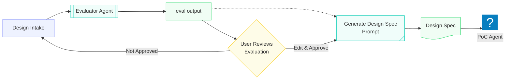

# AI Solutions Architect Exercise Guiding Principles

## Overview

This repository represents my official submission for the AI Engineer Candidate Design Exercise. All materials in this repository were created by myself with AI-assisted support during the development process.

## Global Assumptions
- For each design task, I will define a list of guiding assumptions that drive the design. In practice, these assumptions would be gathered during an official requirements session and validated against the needs of the key project stakeholders.
- All non-publicly available data will be created using gen-AI based on needs.
  - Size of sample data will be driven by the needs of the individual tasks. Some solutions may need more data than other to evaluate effectiveness
- End-to-End implementations of solutions are out of scope, the primary deliverable to Dynamix Group is a hypothetical design that demonstrates working knowledge of the defined problem statement, as well as proofs of concept to showcase the specific _capabilities_ that may present in a final working model.

## Strategy

Each task follows a consistent pipeline:

 > See § Repository Details for more information

### ADLC Framing

The evaluation strategy's central theme is grounded in the ADLC (Agent Development Life Cycle) — the emerging evolution of SDLC toward reliable, safe, and purposeful AI agents. I generated the template based on document from Microsoft's Agent Design Framework and Salesforce's Agent Lifecycle documentation

> **Note for reviewers:** My evaluation strategy demonstrates a *general* evaluation approach. In a real engagement, I'd re-draft it collaboratively with stakeholders around scope, priorities, and budget. I'd also recommend separate evaluation strategies for internal vs. external client needs — external clients bring widely varying adoption readiness, budgets, and existing tooling constraints.

## Repository Structure

| Path                                   | Description                                                                                                                                                                                                                                  |
| -------------------------------------- | -------------------------------------------------------------------------------------------------------------------------------------------------------------------------------------------------------------------------------------------- |
| [.claude/agents](.claude/agents)       | Three Claude Code subagents: the [Evaluator](.claude/agents/evaluator.md) that drives the evaluation pipeline, and task-specific PoC agents for [Task 1](.claude/agents/quotepilot-bom.md) and [Task 2](.claude/agents/rfp-orchestrator.md). |
| [.claude/commands](.claude/commands)   | Contains `/generate_design_spec` — the prompt uses the intake and eval outputs and produces a complete design spec for the user to work from                                                                                                 |
| [.strategies](.strategies)             | Contains `evaluation_strategy.md` — the template the Evaluator Agent walks against each design intake to produce structured eval outputs.                                                                                                    |
| [.templates](.templates)               | Contains `ai-agent-design-template.md` — the gold-standard spec structure that `/generate_design_spec` models output against.                                                                                                                |
| [artifacts](artifacts)                 | Per-task folders for Tasks 1, 2, and 4. Each contains the task definition, design intake, evaluation report, evaluation YAML, and final design spec which gets migrated to the respective repo.                                              |
| **[GreenLight](GreenLight/README.md)** | Task 4 — AI Readiness Assessment.                                                                                                                                                                                                            |
| **[KnowledgeX](KnowledgeX/README.md)** | Task 2 — RFP/RFI Response Agent.                                                                                                                                                                                                             |
| **[QuotePilot](QuotePilot/README.md)** | Task 1 — Quote BOM Agent.                                                                                                                                                                                                                    |
| [CLAUDE.MD](CLAUDE.MD)                 | Claude Code project instructions defining how AI assistance operates within this repository.                                                                                                                                                 |

## Additional Contributions

Prior to receiving these designs tasks, I self-identified a potential challenge Dynamix might face and created VendorVault. It is a fully functional proof of concept I designed around a fictional company called Kinematix Group to give it the right operational context. It's built around the kind of vendor intelligence challenges I'd expect a company like Dynamix to face, or to help its mid-market and enterprise clients navigate.

**Working Demo:** [VendorVault](https://kinematixgroup.site/)

**Repository:** [VendorVault (Github)](https://github.com/robidaz/VendorVault)
