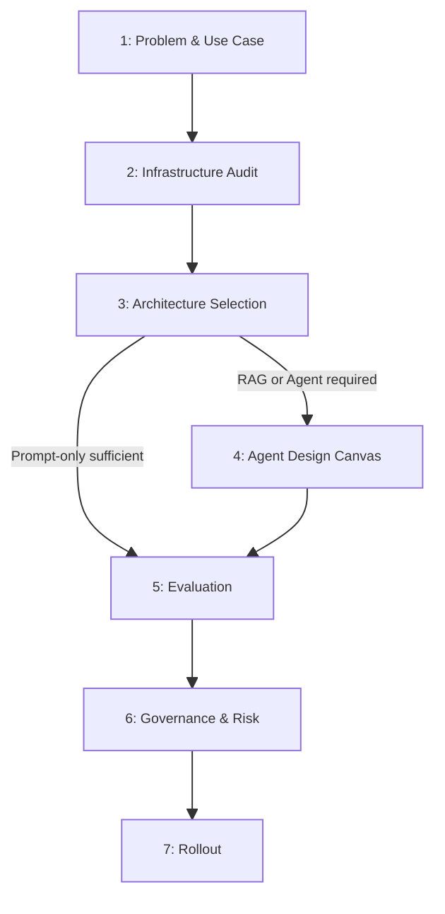

# Task 1 — Quote/BOM Agent: Evaluation Report

**Client input:** `design_exercise_artifacts/task_1_quote_bom_agent/task_1_design_intake.md`
**Template version:** 0.2
**Completed at:** 2026-05-10
**Evaluator notes:** Tier 3 agent recommended; 14 UNKNOWN fields concentrated in infrastructure, governance, and quantitative metrics.

---

## Summary

The client (Dynamix Group) wants an AI agent that converts a sales engineer's written customer requirements into a multi-vendor Bill of Materials with three price/performance tiers, drawing from a JSON/YAML catalog of 50 vendors and a user-maintained rulesets document. The intake is clear enough to select Tier 3 (Agent) with a `single_agent` orchestration pattern and a `diy` ingestion approach. There are 14 UNKNOWN fields, concentrated in infrastructure audit (no existing tooling described), governance/security (no stated constraints or strategies), and all quantitative success metrics.

---

### Phase Overview

---

## 1. Problem & Use Case

### 1.1 Use Case Statement

| Field | Response |
| ----- | -------- |
| When (situation / trigger) | A sales engineer receives a customer's technical requirements and must build a BOM manually across 200+ vendor catalogs. | confidence: INFERRED | source: "rationale: intake lines 3-5 describe the trigger as receiving customer requirements and pulling SKUs across catalogs" |
| I need to (task / motivation) | Automatically convert customer technical requirements into a validated, multi-vendor BOM with availability, lead time, and margin evaluation. | confidence: FOUND | source: "Agent that converts a customer technical requirement into a multi-vendor BOM" (line 26) |
| So I can (expected outcome) | Reduce quote turnaround time and compete more effectively, delivering a three-tier price/performance BOM with justification. | confidence: FOUND | source: "Quote turnaround time is one of the levers we use to compete; today, it is slower than it should be." (lines 5-6) and "BoM with 3 tiers of price/performance" (line 43) |
| Who are the users and what is their technical fluency? | Sales engineers with basic product knowledge; responsible for producing the curated customer requirements list. | confidence: FOUND | source: "Sales engineer is responsible for producing a curated list of customer requirements" and "Sales engineer has basic knowledge of the product suite" (lines 12-13) |
| What does the current workflow look like? | Sales engineers manually pull SKUs across vendor catalogs, validate availability and lead times, calculate margin, and assemble alternatives — all without automated tooling. | confidence: FOUND | source: "Sales engineers spend significant time manually building Bills of Materials…pulling SKUs across catalogs, validating availability and lead times, calculating margin" (lines 3-5) |

### 1.2 Is AI the Right Tool?

| Gate | Answer | Confidence |
| ---- | ------ | ---------- |
| Task well-defined with clear inputs/outputs? | Yes — input is a curated customer requirements list; output is a structured multi-vendor BOM with three tiers, justification, and relevant SKU data points. | FOUND | source: lines 26, 43-45 |
| Requires language understanding or generation? | Yes — the agent must translate natural-language customer requirements against a user-maintained rulesets document and generate justification text. | FOUND | source: "Agent references a 'rulesets & guidelines' source…serves as the translation basis" (lines 29-31) and "Justification of choices and soft recommendation" (line 45) |
| Correctness requires human-level judgment? | Partial — evaluation against availability, lead time, and margin is rule-driven, but soft recommendations and ruleset interpretation require judgment. The intake explicitly requires the agent to prioritize accuracy over completeness. | INFERRED | source: "rationale: lines 33-34 require rule-based evaluation; line 35 requires accuracy-over-results judgment; lines 19-21 place ruleset curation with the human SE" |

| Field | Value |
| ----- | ----- |
| Recommendation | `proceed` | confidence: FOUND | source: "rationale: all three gates pass; the task is well-defined, requires language generation, and the human-judgment component is bounded by SE-owned rulesets" |

### 1.3 Success Criteria

| Criterion | Metric | Target | Confidence |
| --------- | ------ | ------ | ---------- |
| Answer quality | Supported answer rate | UNKNOWN — no numeric target stated | UNKNOWN |
| User adoption | Task completion rate | UNKNOWN — no numeric target stated | UNKNOWN |
| Escalation rate | % of tasks requiring human override | UNKNOWN — no numeric target stated | UNKNOWN |

---

## 2. Infrastructure Audit

### 2.1 Existing Knowledge Systems

| Field | Value | Confidence |
| ----- | ----- | ---------- |
| Enterprise search platform exists? | no | INFERRED | source: "rationale: intake specifies a bespoke JSON/YAML catalog and a user-maintained rulesets doc; no mention of an enterprise search platform" |
| Platform name (if yes) | NA | NA |
| API or MCP integration available? | NA | NA |
| Integration contract documented? | NA | NA |

### 2.2 Existing Tooling

| Category | What exists | Integration complexity | Confidence |
| -------- | ----------- | ---------------------- | ---------- |
| Identity / auth | UNKNOWN | UNKNOWN | UNKNOWN |
| Data stores | JSON or YAML flat-file catalog; user-maintained rulesets & guidelines document | Low (direct file read) | INFERRED | source: "PoC will have a specific data source…in the form of JSON or YAML" (line 10); "rulesets & guidelines source initially provided by user" (line 29) |
| Communication platforms | UNKNOWN | UNKNOWN | UNKNOWN |
| Line-of-business systems | UNKNOWN — no CRM, ERP, or quoting platform is mentioned | UNKNOWN | UNKNOWN |

---

## 3. Architecture Selection

| Field | Value | Confidence |
| ----- | ----- | ---------- |
| Selected tier | 3 — Agent | INFERRED | source: "rationale: the workflow requires multi-step task completion (read rulesets, query catalog, evaluate constraints, generate tiered BOM) and conditional write-back (agent may modify rulesets when explicitly permitted — line 31)" |
| Rationale | The agent must (1) read a dynamic rulesets document before every evaluation, (2) query a structured catalog across multiple dimensions (availability, lead time, margin), (3) apply vendor-consistency constraints per category, (4) produce a three-tier structured output with justification, and (5) optionally write back to the rulesets source. Steps 1-4 alone exceed Tier 2; step 5 confirms Tier 3. | INFERRED | source: "rationale: lines 29-31, 33-35, 43-45 collectively describe multi-step reasoning and conditional write access" |

---

## 4. Agent Design Canvas

### 4.1 Use Case & Triggers

| Element | Value | Confidence |
| ------- | ----- | ---------- |
| Use case goal (Jobs To Be Done restatement) | When a sales engineer submits a curated customer requirements list, the agent must produce a validated multi-vendor BOM in three price/performance tiers so the SE can turn around a competitive quote faster. | INFERRED | source: "rationale: synthesis of lines 3-6, 26, 43-45" |
| Triggers (events that initiate the workflow) | Explicit user submission of customer requirements to the agent (manual/on-demand trigger). | INFERRED | source: "rationale: 'Sales engineer is responsible for producing a curated list of customer requirements' (line 12); no event-driven or scheduled trigger is mentioned" |
| Channels (where users interact with the agent) | UNKNOWN — no UI, API surface, chat platform, or CLI is specified in the intake. | UNKNOWN |

### 4.2 Knowledge & Data

| Source | Format | Update frequency | Owner | Confidence |
| ------ | ------ | ---------------- | ----- | ---------- |
| Vendor/distributor product catalog (50 vendors, multiple SKUs per vendor, multiple categories) | JSON or YAML | Has a last-updated field at source level and effective-date field at vendor level; no SKU-level tracking | Agent is not responsible for updates — owner UNKNOWN | FOUND | source: lines 10-11, 15-17 |
| Rulesets & guidelines document (acceptable lead times, evaluation fallback rules, product class descriptions) | UNKNOWN format | Updated manually by SE or via prompt | Sales engineer | FOUND | source: lines 19-21, 29-31 |
| Customer requirements input (per-session) | UNKNOWN — structured text or form submission implied | Per-session (ephemeral) | Sales engineer | INFERRED | source: "rationale: line 12 says SE produces a curated requirements list; format not specified" |

| Field | Value | Confidence |
| ----- | ----- | ---------- |
| Ingestion approach | `diy` — the catalog is a bespoke JSON/YAML file generated by a Python script; no framework is mentioned. | INFERRED | source: "Catalog data is created using a python script…specific to the task" (line 9) |
| Chunking strategy | UNKNOWN — catalog is structured JSON/YAML so traditional text chunking may not apply; a lookup/query pattern is more likely, but no strategy is stated. | UNKNOWN |
| Curation owner | Catalog: unspecified (agent explicitly excluded from updates). Rulesets: sales engineer. | FOUND | source: "Agent is not responsible for updating/managing data source" (line 16); "Sales engineer provides an initial source of definitions and rules" (line 19) |
| Update / supersession handling | Catalog has a source-level last-updated field and per-vendor effective date; no SKU-level effective date. Rulesets updated manually by SE. Agent must surface data freshness to user. | FOUND | source: lines 15-17, 21 |

**Metadata schema:**

| Field | Required? | Confidence |
| ----- | --------- | ---------- |
| Source / document type | Yes — catalog vs. rulesets vs. customer input must be distinguishable | INFERRED | source: "rationale: agent reads rulesets before evaluations (line 30); separation of source types is required for correct behavior" |
| Date / version | Yes — catalog last-updated and vendor effective-date are explicitly called out | FOUND | source: "Data source returns key date fields indicating last updated overall source data, as well as effective date of each vendor's catalog" (lines 15-16) |
| Approval status | UNKNOWN — not mentioned | UNKNOWN |
| Scope / jurisdiction | Not applicable for this use case (no regulatory scope described); UNKNOWN whether product-category scoping is encoded as metadata | UNKNOWN |

### 4.3 Tools & Integrations

| Tool | Action type | Reversible? | Requires human approval? | Confidence |
| ---- | ----------- | ----------- | ------------------------ | ---------- |
| Catalog reader (JSON/YAML file read) | Read | Yes (read-only) | No | INFERRED | source: "rationale: agent must query catalog for availability, lead time, margin (line 33); read-only in v1 consistent with agent not managing data source (line 16)" |
| Rulesets reader | Read | Yes (read-only) | No | FOUND | source: "Agent reads this document before performing any evaluations" (line 30) |
| Rulesets writer (conditional) | Write | No — overwrites document | Yes — requires explicit user grant | FOUND | source: "Agent has the ability to modify this source when given explicit access to do so by the user" (line 31) |
| BOM output generator (structured report) | Write (output artifact) | Yes — generates new artifact | No (SE reviews before sending to customer) | INFERRED | source: "rationale: deliverables are a BoM artifact with tiers and justification (lines 43-45); SE is presumably the reviewer before customer delivery" |

### 4.4 Flows & Orchestration

| Field | Value | Confidence |
| ----- | ----- | ---------- |
| Selected pattern | `single_agent` | INFERRED | source: "rationale: all steps (read rulesets, query catalog, apply constraints, generate BOM) are performed by one agent; no evidence of subagent delegation or parallel pipelines in the intake" |
| Rationale | The workflow is sequential — load rulesets, parse requirements, query catalog iteratively per category, apply vendor-consistency and constraint rules, assemble tiers, generate output. A single agent loop with tool calls covers this without requiring orchestrator/subagent decomposition at PoC scope. | INFERRED | source: "rationale: intake describes a single coherent task scope for PoC (lines 8-22); 3-4 product categories, 50 vendors" |

### 4.5 Instructions & Behavior

| Element | Decision | Confidence |
| ------- | -------- | ---------- |
| Agent role / persona | BOM generation assistant for sales engineers; technical, precise, no fabrication of catalog data. | INFERRED | source: "rationale: lines 33-35 require accuracy-over-results; agent serves sales engineers (line 22)" |
| Output format | Structured BOM with three price/performance tiers; each tier includes SKU, vendor, relevant data points, and a justification/soft recommendation. | FOUND | source: "BoM with 3 tiers of price/performance / Relevant data points from the Vendor/SKU selected / Justification of choices and soft recommendation" (lines 43-45) |
| Citation behavior | Agent must indicate which catalog entries and vendor data points support each SKU selection; data freshness (effective date) should be surfaced. | INFERRED | source: "rationale: accuracy-over-results requirement (line 35) and explicit date fields (lines 15-17) imply traceability to source entries is required" |
| Abstention behavior | If a specific vendor/SKU request cannot be met, the agent must say so rather than substitute silently. If no data is available for a requirement, the output may be that no data is available. | FOUND | source: "Agent must prioritize information accuracy over results returned, meaning the output may be that no data is available" (line 35); "If initial user request can not be met" (line 33, sentence incomplete — see Open Items) |
| Scope boundary (what is out of scope) | Full pricing engine, contract pricing, customer portal UI. Agent does not update or manage the catalog data source. | FOUND | source: lines 36-39, 16 |

### 4.6 Agent Architecture & Components

| Component | New or existing | Notes | Confidence |
| --------- | --------------- | ----- | ---------- |
| Core agent (LLM-orchestrated loop) | New | Reads rulesets, parses requirements, calls tools, generates BOM | INFERRED | source: "rationale: no existing agent infrastructure is mentioned" |
| Catalog data store (JSON/YAML file) | New (PoC-generated) | Created by Python script; 50 vendors, multiple SKUs, 3-4 product categories | FOUND | source: lines 9-11 |
| Rulesets & guidelines document | New (SE-authored) | Initial content provided by SE; agent can modify with explicit SE approval | FOUND | source: lines 19-21, 29-31 |
| BOM output template (boilerplate) | New | Boilerplate template used for PoC output | FOUND | source: "A boilerplate BOM template is be used for PoC" (line 11) |
| Catalog data generation script (Python) | New | Generates repeatable synthetic catalog data for PoC | FOUND | source: "Catalog data is created using a python script created by Claude for repeatable data output" (line 9) |

---

## 5. Evaluation

### 5.1 Quality Metrics

| Metric | Target | Confidence |
| ------ | ------ | ---------- |
| Supported answer rate | UNKNOWN — no numeric target stated; intake implies 100% preference but no threshold defined | UNKNOWN |
| Abstention rate | UNKNOWN — intake requires abstention when data is unavailable but sets no target rate | UNKNOWN |
| Task completion rate | UNKNOWN — no numeric target stated | UNKNOWN |

### 5.2 Abstention Behavior

| Scenario | Required behavior | Confidence |
| -------- | ----------------- | ---------- |
| No relevant sources retrieved | Output must state that no data is available; do not fabricate or substitute. | FOUND | source: "Agent must prioritize information accuracy over results returned, meaning the output may be that no data is available based on the users request." (line 35) |
| Low confidence match | UNKNOWN — not specified; intake implies err-on-side-of-abstention but no explicit threshold | UNKNOWN |
| Conflicting sources | UNKNOWN — not addressed; vendor catalog may have conflicts across distributors for same SKU | UNKNOWN |
| Question out of scope | Decline gracefully; scope exclusions (pricing engine, contract pricing, portal UI) are explicit. Agent should not attempt to address excluded areas. | FOUND | source: lines 36-39 |

---

## 6. Governance & Risk

### 6.1 Human-in-the-Loop Gates

| Action | Risk level | Gate | Confidence |
| ------ | ---------- | ---- | ---------- |
| Modifying the rulesets & guidelines document | High — changes affect all future evaluations | Requires explicit user (SE) grant before write access is enabled | FOUND | source: "Agent has the ability to modify this source when given explicit access to do so by the user" (line 31) |
| BOM delivery to customer | Medium — incorrect BOM could cause pricing or sourcing errors | SE reviews output before customer delivery (implied; not explicitly stated) | INFERRED | source: "rationale: SE is the named user; no automated delivery pipeline is described; scope excludes customer portal UI (line 39)" |

### 6.2 Security

| Field | Value | Confidence |
| ----- | ----- | ---------- |
| Prompt-injection mitigation strategy | UNKNOWN — not addressed in intake | UNKNOWN |
| Tool least-privilege approach | Catalog reader is read-only; rulesets writer requires explicit SE approval. No other tool write access scoped. | INFERRED | source: "rationale: line 16 excludes agent from catalog updates; line 31 gates rulesets writes behind explicit approval — consistent with least-privilege pattern" |
| Sensitive-field redaction in pipeline | UNKNOWN — intake does not identify any PII or sensitive fields in catalog or customer requirements | UNKNOWN |

### 6.3 Data & Deployment Constraints

| Requirement | Present? | Impact | Confidence |
| ----------- | -------- | ------ | ---------- |
| Data residency (must stay in region) | UNKNOWN | UNKNOWN | UNKNOWN |
| Air-gap / on-prem required | UNKNOWN | UNKNOWN | UNKNOWN |
| Regulated data (PII, PHI, financial) | No PII/PHI evident; catalog data is vendor/product/pricing data. Margin data may be commercially sensitive. | INFERRED | source: "rationale: intake describes vendor catalog SKUs, availability, lead time, margin — no PII; margin figures could be commercially sensitive but no regulatory classification stated" |

| Field | Value | Confidence |
| ----- | ----- | ---------- |
| Selected deployment model | UNKNOWN — not specified in intake | UNKNOWN |
| Rationale | UNKNOWN | UNKNOWN |

---

## 7. Rollout

| Artifact | Versioned? | Requires eval before deploy? | Confidence |
| -------- | ---------- | ---------------------------- | ---------- |
| System prompt | UNKNOWN — not addressed | UNKNOWN | UNKNOWN |
| Retrieval configuration | UNKNOWN — not addressed | UNKNOWN | UNKNOWN |
| Model version | UNKNOWN — not addressed | UNKNOWN | UNKNOWN |
| Tool definitions | UNKNOWN — not addressed | UNKNOWN | UNKNOWN |

| Field | Value | Confidence |
| ----- | ----- | ---------- |
| Rollback trigger | UNKNOWN — not specified | UNKNOWN |

---

## Appendix: Decision Summary

| Decision | Selected | Rationale | Confidence |
| -------- | -------- | --------- | ---------- |
| Architecture tier | Tier 3 — Agent | Multi-step task with conditional write-back exceeds Tier 2 | INFERRED |
| Existing retrieval platform? | No | Bespoke JSON/YAML catalog; no enterprise search mentioned | INFERRED |
| Ingestion approach | diy | Python-generated flat-file catalog; no ingestion framework mentioned | INFERRED |
| Orchestration pattern | single_agent | Single sequential workflow; no subagent delegation evident at PoC scope | INFERRED |
| Deployment model | UNKNOWN | Not specified in intake | UNKNOWN |
| Primary rollback trigger | UNKNOWN | Not specified in intake | UNKNOWN |

---

## Appendix: Open Items

| Item | Phase blocked | Why this matters | Suggested resolution path |
| ---- | ------------- | ---------------- | ------------------------- |
| Interaction channel / UX surface for agent (CLI, chat, API, web form?) | Phase 4.1 (canvas_channels) | Determines how the SE submits requirements and receives the BOM; affects prompt design and tool interface | Ask client during next requirements session |
| Success metric numeric targets (supported answer rate, completion rate, escalation rate) | Phase 1.3 and Phase 5.1 | Without targets there is no pass/fail criterion for the evaluation harness | Ask SE/PM to define acceptable quality bar before build; suggest starting with >90% supported answer rate |
| Abstention threshold for low-confidence matches | Phase 5.2 | Agent needs a confidence floor below which it should abstain rather than return a partial or speculative BOM line | Define in rulesets & guidelines document; SE to specify during ruleset authoring session |
| Behavior when conflicting catalog data exists for the same SKU across distributors | Phase 5.2 | Arrow and TD Synnex may list different lead times for identical SKUs; agent must know which to prefer or whether to flag conflict | Add a conflict-resolution rule to the rulesets & guidelines document; SE to specify priority order |
| Incomplete requirement in intake line 33: "If initial user request can not be met" — sentence is cut off | Phase 4.5 (abstention_behavior) | The fallback behavior for unmet specific vendor/SKU requests is undefined | Obtain full sentence from client; likely intent is "agent must report the constraint violation and offer alternatives" |
| Identity / auth infrastructure | Phase 2.2 (tooling_identity) | Gating rulesets write access requires knowing the auth model (who is a valid SE, how is approval signaled) | Ask client: is there an existing SSO or role system? How does the SE signal explicit write approval? |
| Line-of-business system integrations (CRM, ERP, quoting platform) | Phase 2.2 (tooling_lob) | Future BOM export or quote integration may require LOB connectors; scoping now prevents rework | Ask client whether BOM output is standalone or must feed a quoting/CRM system |
| Rulesets document format | Phase 4.2 (knowledge_source) | Affects ingestion/parsing approach (plain text, YAML, structured JSON?) | Ask SE what format the initial rulesets document will be authored in |
| Customer requirements input format | Phase 4.2 (knowledge_source) | Agent must parse this input; structured form vs. free text affects prompt design significantly | Clarify with SE: will requirements be free-text prose, a structured checklist, or a templated form? |
| Catalog metadata: approval status | Phase 4.2 (meta_approval) | If vendor catalog data must be approved before use, the agent needs a filter | Ask client: is there a data approval/QA step for the catalog Python script output? |
| Data residency and air-gap requirements | Phase 6.3 | Determines eligible LLM providers and whether cloud APIs are permissible | Ask IT/legal: any data sovereignty or on-prem requirements for vendor pricing data? |
| Deployment model (raw API, managed cloud, self-hosted) | Phase 6.3 and Phase 7 | Affects LLM provider selection, cost model, and security posture | Resolve after data residency question is answered |
| Rollout versioning and rollback trigger | Phase 7 | Without a defined rollback trigger, a degraded agent cannot be safely reverted | Architect to propose standard triggers (e.g., supported answer rate drops below threshold for N consecutive evaluations) for SE sign-off |
| Chunking / retrieval strategy for structured catalog data | Phase 4.2 (chunking_strategy) | JSON/YAML catalogs are best queried via structured lookup rather than vector search; the right approach (SQL-style, JSONPath, semantic) must be selected before build | Architect to evaluate catalog schema from Python script output; recommend structured query tool over vector chunking |
