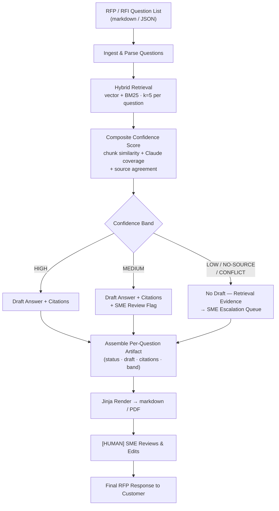

# RFP / RFI Response Agent — Design Document

## Revision History

| Version | Date       | Author      | Notes         |
| ------- | ---------- | ----------- | ------------- |
| 0.1     | 2026-05-12 | Zach Robida | Initial draft |

---

## 1. Problem Framing

> This section captures the initial business requirements defined by the stakeholders prior to transformation into assessment variables leveraged for AI/Agent evaluation.

**Current state:** Sales engineers and product specialists at Dynamix spend significant time manually searching prior RFP responses, technical documentation, partner enablement material, and internal SME knowledge to compose answers for each new customer RFP or RFI. Every engagement is effectively a cold start against the same KB, with no systematic retrieval, no consistency across engineers, and no signal on which answers are well-supported versus guessed.

**Desired outcome:** An engineer submits a structured question list and receives a per-question draft with citations and a confidence band. With this method, they spend their time reviewing and calibrating instead of searching and composing from scratch.

**Success signal:** (1) Supported answer rate ≥ 85%: the percentage of draft answers traceable to a cited KB chunk without SE validation from scratch. (2) SME escalation rate ≤ 25%: the share of questions routed to the escalation queue per engagement. Both are proposed baselines pending client confirmation.
***Note***: *answer/escalation rate metrics will not be calculated in PoC*
---

## 2. Scope

A prompt-only baseline fails: the agent must dynamically retrieve answers from an 8-document KB, perform composite confidence scoring across retrieval signals, and route each question conditionally — none of which is achievable in a single static prompt. No enterprise search platform exists; the KB lives as repo files loaded into a local pgvector store.

### In Scope

- Hybrid semantic + keyword retrieval (pgvector vector search + BM25-style) from a curated 8-document KB
- Composite confidence scoring per question (chunk similarity + Claude-judged coverage + source agreement)
- Five-band routing: HIGH → committed draft; MEDIUM → draft + SME-review flag; LOW / NO-SOURCE / CONFLICT → escalation queue with retrieval evidence
- Per-question artifact: status, draft text (when applicable), citations (source doc + chunk), confidence band
- Jinja-rendered output: markdown + PDF for SME review
- One-shot KB ingestion via documented Python script into local pgvector store

### Out of Scope

- Full PDF / Word document parsing for KB ingestion
- Multi-language support
- DMS / SharePoint / Confluence integration
- KB authoring, curation, or approval workflow
- Auto-submission of responses to customers
- Learning and updating of KB based on SME input. KB is read-only
- Authentication

---

## 3. Assumptions & Constraints

### Assumptions

1. RFP input arrives as a pre-structured markdown or JSON question list; freeform prose RFPs are out of scope for v1.
2. The KB consists of 8 pre-approved markdown documents (3 prior RFP responses, 2 spec sheets, 2 partner-enablement docs, 1 internal SME FAQ); all are static for the PoC.
3. KB documents are pre-approved and curated; the agent has no write access and is not responsible for provenance validation or KB updates.
4. A single embedding model is used for both ingestion and query time; choice is documented and configurable.
5. The SME (sales engineer or product specialist) is the sole party that finalizes responses; no auto-submission to customers under any condition.

### Constraints

- **Technology:** Python backend; Anthropic Claude API; pgvector (local); Jinja2 for output rendering; single embedding model (configurable).
- **Data:** Synthetic KB documents only. No real customer RFP content in this prototype.
- **Autonomy:** Agent produces draft artifacts only. The SME approves, edits, or rejects all output before customer delivery. No auto-send.

---

## 4. Architecture Overview



### Component Inventory

| Component                 | Technology                  | Role                                                                                |
| ------------------------- | --------------------------- | ----------------------------------------------------------------------------------- |
| KB ingestion script       | Python                      | One-shot: chunks 8 markdown docs, generates embeddings, loads pgvector              |
| pgvector store            | pgvector (local)            | Stores chunk embeddings + BM25-compatible index                                     |
| Embedding model           | Configurable (single model) | Encodes KB at ingestion and questions at query time                                 |
| Hybrid retrieval layer    | pgvector + keyword          | Semantic vector search + BM25-style at k=5, filtered by relevance score             |
| Confidence scoring module | Python + Claude             | Composite of chunk similarity, Claude-judged coverage, source agreement             |
| Routing logic             | Python                      | Branches on confidence band to draft path or escalation queue                       |
| Draft generator           | Claude (Anthropic)          | Produces cited answer from retrieved chunks; abstains when evidence is insufficient |
| Jinja renderer            | Jinja2                      | Renders per-question artifact and full response document to markdown/PDF            |
| SME escalation queue      | Python / flat file          | Structured list of escalated items with full retrieval evidence attached            |

---

## 5. Data Flow

### Data Sources

| Source                           | Type                       | Format          | Notes                                  |
| -------------------------------- | -------------------------- | --------------- | -------------------------------------- |
| Prior RFP responses (3 docs)     | Synthetic (PoC)            | Markdown        | Static for PoC; one-shot ingestion     |
| Spec sheets (2 docs)             | Synthetic (PoC)            | Markdown        | Static for PoC                         |
| Partner-enablement docs (2 docs) | Synthetic (PoC)            | Markdown        | Static for PoC                         |
| Internal SME FAQ (1 doc)         | Synthetic (PoC)            | Markdown        | Static for PoC                         |
| RFP/RFI question list            | Per-engagement (ephemeral) | Markdown / JSON | Pre-structured; validated at ingestion |

### Processing Pipeline

1. **Ingest:** Question list arrives as markdown or JSON. Parser extracts individual questions with their identifiers. Malformed input or missing structure triggers a rejection with a descriptive error.

2. **Retrieve:** For each question, the hybrid retrieval layer runs parallel vector similarity and BM25-style keyword search, merges ranked results, and returns the top-k=5 chunks filtered by a minimum relevance score. Questions with zero chunks above threshold are tagged `NO-SOURCE` immediately.

3. **Score:** Composite confidence is computed: (a) chunk similarity score from retrieval, (b) Claude-judged coverage — does the retrieved evidence actually answer the question?, (c) source agreement — do multiple sources agree or conflict? The three signals combine into a band: HIGH / MEDIUM / LOW / NO-SOURCE / CONFLICT.

4. **Route:** The routing logic branches deterministically on the band. HIGH and MEDIUM proceed to draft generation. LOW / NO-SOURCE / CONFLICT skip draft generation entirely; retrieved evidence is packaged for the SME escalation queue.

5. **Draft:** Claude receives the retrieved chunks, source metadata, and the question. It produces a cited answer (HIGH) or a cited draft with an uncertainty note (MEDIUM). CONFLICT questions receive both conflicting versions, both cited, with no winner selected. Abstention is the default when evidence is insufficient.

6. **Assemble & Render:** Each question's output (status, draft text, citations, confidence band) is assembled into a per-question artifact. Jinja renders the full response document to markdown and PDF.

7. **Stage for Review:** The rendered document and the SME escalation queue land in the SME review workflow. Neither is released to the customer without SME sign-off.

---

## 6. Agent Decision Logic

### Confidence Scoring

| Band      | Criteria                                                                            | Routing                                                                     |
| --------- | ----------------------------------------------------------------------------------- | --------------------------------------------------------------------------- |
| HIGH      | Chunk similarity above threshold + Claude judges coverage as strong + sources agree | Draft committed; route to SME review queue                                  |
| MEDIUM    | Coverage adequate but confidence not fully high — one signal is marginal            | Draft generated + SME-review flag attached                                  |
| LOW       | Retrieval returned chunks but Claude judges coverage as insufficient                | No draft; escalate to SME with retrieval evidence                           |
| NO-SOURCE | Zero chunks above relevance threshold                                               | No draft; escalate with original question and best-effort retrieval context |
| CONFLICT  | Multiple sources retrieved that disagree on the same point                          | No draft; both conflicting versions surfaced and cited; escalate to SME     |

### Prompt Design

| Prompt Element              | Position                | Notes                                                                   |
| --------------------------- | ----------------------- | ----------------------------------------------------------------------- |
| Role + task instructions    | First (stable — cached) | Factual drafting assistant; accuracy-first; abstention over speculation |
| Citation format rules       | First (stable — cached) | Every claim cites source doc + chunk identifier; multi-source cites all |
| Abstention rules            | First (stable — cached) | LOW/NO-SOURCE/CONFLICT → no fabricated draft; state what is missing     |
| Conflict handling rules     | First (stable — cached) | Surface both versions, cite both, do not pick a winner                  |
| Retrieved chunks + metadata | Dynamic                 | Top-k chunks with source doc, chunk ID, similarity score                |
| Question                    | Last (dynamic)          | Per-question at query time                                              |

### Structured Output Schema

```python
from pydantic import BaseModel
from typing import Optional, List, Literal

class Citation(BaseModel):
    source_doc: str
    chunk_id: str
    similarity_score: float

class QuestionArtifact(BaseModel):
    question_id: str
    question_text: str
    status: Literal["drafted", "drafted_flagged", "escalated", "conflict", "no_source"]
    confidence_band: Literal["HIGH", "MEDIUM", "LOW", "NO_SOURCE", "CONFLICT"]
    draft_text: Optional[str]        # None when status is escalated/conflict/no_source
    citations: List[Citation]        # Empty only for NO_SOURCE
    conflict_versions: Optional[List[str]]   # Populated for CONFLICT band only
    escalation_reason: Optional[str] # Populated when status is not drafted

class RFPResponseArtifact(BaseModel):
    engagement_id: str
    questions: List[QuestionArtifact]
    escalation_queue: List[QuestionArtifact]   # Subset with non-drafted status
    requires_human_review: bool                 # Always True
```

---

## 7. Human Checkpoints

| Checkpoint           | Trigger                                 | What the Human Sees                                                                                | Human Action                                                  | If No Action Taken                                            |
| -------------------- | --------------------------------------- | -------------------------------------------------------------------------------------------------- | ------------------------------------------------------------- | ------------------------------------------------------------- |
| SME Full Review      | Rendered response document delivered    | All per-question artifacts: drafted answers, citations, confidence bands, SME-flagged MEDIUM items | Approve / Edit / Reject per question                          | Document stays in draft; not released to customer             |
| SME Escalation Queue | Any LOW / NO-SOURCE / CONFLICT question | Question + confidence band + full retrieval evidence (no fabricated draft)                         | Provide answer directly / supply a source / mark unanswerable | Queue stays open; that question has no answer in the response |
| CONFLICT Resolution  | Two sources disagree                    | Both conflicting versions, both fully cited                                                        | Select authoritative version / request source clarification   | Conflict item stays unresolved in the escalation queue        |

### What Humans Remain Accountable For

- **Final approval** of all customer-facing RFP/RFI response content
- **Conflict resolution** — the agent never picks a winner between disagreeing sources
- **KB quality** — the agent reports what it finds; correctness of the KB is the curator's responsibility
- **Escalation closure** — questions in the escalation queue are unanswered until the SME acts

---

## 8. Failure Modes

| Failure Mode                      | Trigger                                                           | System Response                                                                               | Human Action Required                          |
| --------------------------------- | ----------------------------------------------------------------- | --------------------------------------------------------------------------------------------- | ---------------------------------------------- |
| No retrieval match                | Zero chunks above relevance threshold for a question              | NO-SOURCE band; no draft; best-effort retrieval context surfaced to SME                       | SME provides answer or marks unanswerable      |
| Conflicting sources               | Retrieved chunks disagree on the same point                       | CONFLICT band; both versions cited; no winner selected; escalated                             | SME selects authoritative version              |
| Low coverage                      | Chunks retrieved but Claude judges them as insufficient to answer | LOW band; no draft; evidence surfaced to SME                                                  | SME answers directly or provides a source      |
| Topically out-of-scope question   | Question outside KB subject matter                                | NO-SOURCE or LOW band (no distinguishing signal at PoC); escalated                            | SME determines whether it belongs in the KB    |
| Prompt injection in question text | RFP question contains adversarial instructions                    | Input validation layer strips/rejects; question not passed to retrieval                       | SME reviews any rejected questions manually    |
| Stale KB content                  | KB documents have not been updated and contain outdated specs     | Agent cites the stale chunk; no freshness signal available at PoC without metadata date field | SME confirms answer accuracy before finalizing |

### "I Don't Know" Cases

- Question has no matching KB chunk above the relevance threshold → NO-SOURCE; agent states what is missing, does not fabricate
- Retrieved chunks are returned but Claude cannot form a defensible answer from them → LOW; no draft generated
- Two or more chunks give conflicting answers to the same question → CONFLICT; both surfaces, no synthesis

### Financial / Reputational Risk Scenarios

| Risk Scenario                                       | Potential Impact                               | Design Protection                                                                 |
| --------------------------------------------------- | ---------------------------------------------- | --------------------------------------------------------------------------------- |
| Wrong answer committed to RFP                       | Legal / credibility risk with customer         | Draft-only output; SME finalizes all responses; no auto-submit                    |
| Hallucinated spec or capability claim               | Misrepresentation in binding customer document | Abstention enforced; every claim requires a cited KB chunk                        |
| Conflicting answer submitted without SME resolution | Contradictory commitments in RFP               | CONFLICT band blocks draft generation; SME must resolve before answer is included |

---

## 9. Governance & Security

**Deployment:** Managed Cloud via Anthropic API. No data residency constraints or air-gap requirements identified for the PoC. If RFP content includes NDA-covered pricing or customer PII in production, a data classification review and potential self-hosted deployment evaluation is required before go-live.

### Data Handling

- KB documents and RFP content are local flat files in the PoC. No real customer data in this prototype.
- RFP content may contain commercially sensitive or NDA-covered material in production — **data classification review required before production deployment**.

### Access Control

- Single SME user in PoC; no role-based auth defined. Multi-engineer access requires an auth design (currently UNKNOWN — flagged as open item).

### Security

- **Prompt injection:** RFP question text is treated as user data, not instructions. Retrieved KB chunks are injected into context turns, not the system prompt. Questions undergo a basic validation pass before retrieval. KB content is read-only; the agent has no write access.
- **Least privilege:** KB operations are read-only. The agent writes only to the output artifact and the escalation queue. No write path to the KB source documents under any condition.

---

## 10. Cost & Latency

> Estimates for a single 30-question RFP engagement against the PoC KB (8 markdown docs, ~300–500 token chunks).

| Operation                                  | Model / Service            | Est. Latency | Est. Cost / Run | Notes                                  |
| ------------------------------------------ | -------------------------- | ------------ | --------------- | -------------------------------------- |
| KB ingestion (one-time)                    | Embedding model + pgvector | ~30–60s      | ~$0.01          | One-shot; ~8 docs × avg 10 chunks each |
| Hybrid retrieval per question              | pgvector                   | ~0.05s       | Negligible      | k=5; in-memory for PoC                 |
| Confidence scoring + draft (×30 questions) | claude-sonnet-4-6          | ~2–4s/q      | ~$0.005–0.01/q  | ~2–3K token context per question       |
| Jinja render                               | Jinja2                     | ~1–2s        | Negligible      | Full document render                   |
| **Total per engagement**                   |                            | **~60–120s** | **~$0.15–0.30** | 30-question RFP; scales linearly       |

### Service Targets

| Indicator                     | Target | Notes                                                  |
| ----------------------------- | ------ | ------------------------------------------------------ |
| Retrieval per question        | ~50ms  | pgvector in-memory; negligible at PoC scale            |
| Draft per question            | ~3s    | Sonnet at ~2K context; cached stable prompt            |
| p95 end-to-end (30 questions) | ~120s  | Batch sequential; parallelization would reduce to ~30s |
| Error rate                    | < 5%   | API errors + malformed output combined                 |

### Cost Control Measures

- Stable system prompt (role, citation rules, abstention) sits at the prompt prefix for caching across all questions in the same engagement.
- Output length is bounded per question: citations + draft text; prompt instructs Claude not to elaborate beyond retrieved evidence.
- Retrieval is done with pgvector (no per-question model call for retrieval); Claude is called only at the draft / coverage-judgment step.
- Parallelise question processing in production to reduce wall-clock time.

---

## 11. Future Improvements

- Real DMS / SharePoint / Confluence integration to replace static repo files
- Closed-loop learning: KB updates triggered by SME edits to escalated answers (deferred — KB write access not in PoC scope)
- Full PDF / Word document ingestion for KB sources
- Multi-language RFP and KB support
- Cross-RFP analytics: answer consistency trending, escalation rate by question type
- Metadata enrichment: date / version tags on KB documents to enable freshness filtering at retrieval

---

## Appendix A — KB Chunk Schema

```python
{
  "chunk_id": "rfp-prev-001-chunk-04",
  "source_doc": "prior_rfp_response_2025_q3.md",
  "doc_type": "prior_rfp_response",   # prior_rfp | spec_sheet | partner_enablement | sme_faq
  "approval_status": "approved",       # pre-approved before KB ingestion
  "chunk_text": "...",
  "embedding": [...],                  # vector; model version recorded at ingestion
  "token_count": 342
}
```

---

## Appendix B — Key Design Decisions

| Decision                                          | Alternatives Considered                    | Rationale                                                                                                                                                                |
| ------------------------------------------------- | ------------------------------------------ | ------------------------------------------------------------------------------------------------------------------------------------------------------------------------ |
| Tier 3 (Agent) over Tier 2 (RAG)                  | Pure RAG (retrieve + generate, no routing) | Routing across five confidence bands and writing to a separate escalation queue require orchestration logic beyond a single retrieve-then-generate pass                  |
| Hybrid retrieval (vector + BM25) over pure vector | Pure semantic vector search                | RFP questions frequently contain exact product names, codes, and identifiers where BM25-style keyword matching outperforms semantic similarity                           |
| Five confidence bands over a binary threshold     | Binary high/low gate                       | Distinguishing MEDIUM from LOW allows the agent to produce a useful draft under moderate uncertainty without escalating everything that is less than perfectly confident |
| No KB write-back at PoC                           | Active KB curation from SME edits          | Closed-loop learning adds significant complexity (versioning, approval, conflict detection) and is not needed to validate the core retrieval-and-routing design          |
