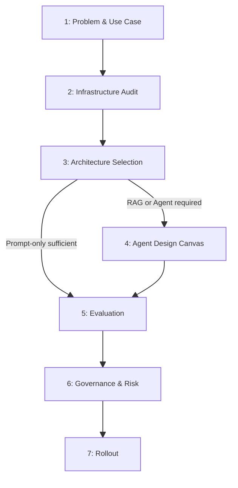

# Task 2 — RFP/RFI Response Agent: Evaluation Report

**Client input:** `design_exercise_artifacts/task_2_rfp_rfi_response_agent/task_2_design_intake.md`
**Template version:** 0.2
**Completed at:** 2026-05-12
**Evaluator notes:** Tier 3 pipeline agent; 12 UNKNOWN fields primarily around numeric targets, deployment constraints, and security mitigations.

---

## Summary

The client (Dynamix) wants an RFP/RFI response drafting agent that ingests structured question lists, retrieves answers from a curated internal knowledge base via hybrid semantic + keyword search, confidence-scores each answer into five bands, and routes low-confidence or conflicting items to a human SME while producing cited draft responses for high-confidence items. The recommended architecture is Tier 3 (Agent) given multi-step orchestration, routing decisions, and tool use requirements. There are 12 UNKNOWN fields, primarily covering infrastructure details (identity/auth, existing tooling, deployment model preference, data-residency constraints) and explicit numeric success targets that were not stated in the intake.

---

## Phase Overview

---

## 1. Problem & Use Case

**Goal:** Frame the problem before any architecture decisions are made.

### 1.1 Use Case Statement

| Field | Response |
| ----- | -------- |
| When (situation / trigger) | Dynamix receives a customer RFP or RFI containing a structured list of questions | confidence: FOUND | source: "Dynamix responds to a high volume of customer RFPs and RFIs" |
| I need to (task / motivation) | Pull accurate answers from prior responses, technical documentation, partner enablement material, and internal SME knowledge — automatically, with confidence scoring and citation | confidence: FOUND | source: "Sales engineers and product specialists spend substantial time pulling answers from prior responses, technical documentation, partner enablement material, and internal SME knowledge" |
| So I can (expected outcome) | Deliver a reviewed, cited draft response faster while surfacing low-confidence and conflicting items to SMEs before the response is finalized | confidence: FOUND | source: "Produce a per-question response artifact the SME can review and edit" |
| Who are the users? | Sales engineers and product specialists (SMEs); moderate-to-high domain fluency; not expected to interact with the LLM directly | confidence: FOUND | source: "the SME (sales engineer or product specialist) is the sole party that finalizes responses" |
| Current workflow | Manual: engineers search prior RFPs and documentation by hand, compose answers themselves, and review before submission | confidence: INFERRED | rationale: "Sales engineers and product specialists spend substantial time pulling answers" implies a manual search-and-compose workflow |

### 1.2 Is AI the Right Tool?

| Gate | Answer | Confidence |
| ---- | ------ | ---------- |
| Task well-defined with clear inputs/outputs? | Yes — input is a structured markdown/JSON question list; output is a per-question artifact (status, draft, citations, confidence band) | FOUND |
| Requires language understanding or generation? | Yes — drafting natural-language answers from retrieved chunks requires generation; ranking and coverage assessment require language understanding | INFERRED |
| Correctness requires human-level judgment? | Yes for ambiguous/conflicting cases — agent explicitly escalates LOW/NO-SOURCE/CONFLICT items to an SME | FOUND |

**Recommendation:** `proceed` — task is well-scoped, language generation is required, and a human-in-the-loop gate is designed in.

### 1.3 Success Criteria

| Criterion | Metric | Target | Confidence |
| --------- | ------ | ------ | ---------- |
| Answer quality | Supported answer rate | UNKNOWN | UNKNOWN |
| User adoption | Task completion rate | UNKNOWN | UNKNOWN |
| Escalation rate | % of tasks requiring human override | UNKNOWN | UNKNOWN |

---

## 2. Infrastructure Audit

### 2.1 Existing Knowledge Systems

| Field | Value | Confidence |
| ----- | ----- | ---------- |
| Enterprise search platform exists? | No — intake explicitly positions KB as repo files loaded into a local pgvector store with no DMS integration | FOUND |
| Platform name | NA | NA |
| API or MCP integration available? | NA | NA |

### 2.2 Existing Tooling

| Category | What exists | Integration complexity | Confidence |
| -------- | ----------- | ---------------------- | ---------- |
| Identity / auth | UNKNOWN | UNKNOWN | UNKNOWN |
| Data stores | Local pgvector store (new, provisioned as part of PoC) | Low — single local instance | FOUND |
| Communication platforms | None — output is a file artifact (markdown/PDF), not a messaging platform | INFERRED | INFERRED |
| Line-of-business systems | None in scope — SharePoint/Confluence explicitly excluded | FOUND | FOUND |

---

## 3. Architecture Selection

| Field | Value | Confidence |
| ----- | ----- | ---------- |
| Selected tier | Tier 3 — Agent | INFERRED |
| Rationale | The system requires multi-step orchestration (retrieve, score, route, draft), conditional branching (HIGH/MEDIUM/LOW/CONFLICT routing), and a write-side action (populating an SME escalation queue) — all of which exceed Tier 2 RAG. | FOUND |

---

## 4. Agent Design Canvas

### 4.1 Use Case & Triggers

| Element | Value | Confidence |
| ------- | ----- | ---------- |
| Use case goal | Given a structured RFP/RFI question list, retrieve grounded evidence from a curated KB, draft cited answers where evidence is strong, and route weak or conflicting items to an SME with full retrieval context | FOUND |
| Triggers | Submission of a pre-structured markdown or JSON RFP/RFI question list to the agent | FOUND |
| Channels | File-based / CLI — no interactive chat interface; output delivered as markdown/PDF artifact | INFERRED |

### 4.2 Knowledge & Data

| Source | Format | Update frequency | Owner | Confidence |
| ------ | ------ | ---------------- | ----- | ---------- |
| Prior RFP responses (3 documents) | Markdown | Static for PoC | UNKNOWN | FOUND |
| Spec sheets (2 documents) | Markdown | Static for PoC | UNKNOWN | FOUND |
| Partner-enablement docs (2 documents) | Markdown | Static for PoC | UNKNOWN | FOUND |
| Internal SME FAQ (1 document) | Markdown | Static for PoC | UNKNOWN | FOUND |

| Field | Value | Confidence |
| ----- | ----- | ---------- |
| Ingestion approach | `diy` — documented Python script, one-shot manual ingestion into local pgvector | FOUND |
| Chunking strategy | Heading-aware for structured docs; paragraph-level for unstructured; ~300–500 token chunks | FOUND |
| Curation owner | UNKNOWN — documents are pre-approved and curated but no owner role is named | UNKNOWN |
| Update handling | Out of scope for PoC — KB is static; closed-loop learning explicitly excluded | FOUND |

**Metadata schema:**

| Field | Required? | Confidence |
| ----- | --------- | ---------- |
| Source / document type | Yes — citations must reference source document + chunk | FOUND |
| Date / version | UNKNOWN | UNKNOWN |
| Approval status | Yes (implied) — documents are pre-approved; approval state is a precondition for inclusion | INFERRED |
| Scope / jurisdiction | UNKNOWN | UNKNOWN |

### 4.3 Tools & Integrations

| Tool | Action type | Reversible? | Requires human approval? | Confidence |
| ---- | ----------- | ----------- | ------------------------ | ---------- |
| pgvector hybrid retrieval (vector + BM25) | Read | Yes | No | FOUND |
| Embedding model (query-time) | Read | Yes | No | FOUND |
| Jinja renderer | Write (output file only) | Yes | No | FOUND |
| SME escalation queue writer | Write (append) | Yes | No — queue population is automatic; SME reviews items | FOUND |

### 4.4 Flows & Orchestration

| Field | Value | Confidence |
| ----- | ----- | ---------- |
| Selected pattern | `pipeline` — sequential per-question pipeline: ingest → retrieve → score → route → draft or escalate → render | INFERRED |
| Rationale | Each question flows through a fixed sequence with conditional branching at the routing step; no dynamic subagent spawning or open-ended planning loop. | FOUND |

### 4.5 Instructions & Behavior

| Element | Decision | Confidence |
| ------- | -------- | ---------- |
| Agent role / persona | Factual drafting assistant that cites sources, surfaces conflicts without adjudicating, and defaults to abstention over speculation | FOUND |
| Output format | Per-question artifact: status (drafted/escalated/conflict) + draft text (when applicable) + citations (source doc + chunk) + confidence band label; rendered to markdown/PDF via Jinja | FOUND |
| Citation behavior | Every drafted answer cites source doc + chunk; multi-source cites all contributing chunks; conflicting sources both cited, no winner selected | FOUND |
| Abstention behavior | LOW/NO-SOURCE/CONFLICT → no fabricated draft; retrieval evidence surfaced first to avoid anchoring bias | FOUND |
| Scope boundary | Full PDF/Word parsing; multi-language; DMS/SharePoint/Confluence; KB authoring/curation/approval; auto-submission; closed-loop learning; cross-RFP analytics | FOUND |

### 4.6 Agent Architecture & Components

| Component | New or existing | Notes | Confidence |
| --------- | --------------- | ----- | ---------- |
| KB ingestion script (Python) | New | One-shot manual; generates embeddings index from 8 markdown files into pgvector | FOUND |
| pgvector store | New | Local instance; stores chunk embeddings + BM25-compatible index | FOUND |
| Embedding model | New (configured) | Single model used at ingestion and query time; documented and configurable | FOUND |
| Hybrid retrieval layer | New | Semantic vector search + BM25-style keyword at k=5 with relevance score filter | FOUND |
| Confidence scoring module | New | Composite of chunk similarity + Claude-judged coverage + source agreement; outputs HIGH/MEDIUM/LOW/NO-SOURCE/CONFLICT bands | FOUND |
| Routing / orchestration logic | New | Branches on confidence band: HIGH → commit draft; MEDIUM → draft + SME flag; LOW/NO-SOURCE/CONFLICT → escalation queue | FOUND |
| Jinja renderer | New | Renders per-question artifact to markdown/PDF | FOUND |
| SME escalation queue | New | Structured list of escalated items with retrieval evidence attached | FOUND |
| Claude (LLM) | Existing (API) | Used for draft generation and Claude-judged coverage scoring | INFERRED |

---

## 5. Evaluation

### 5.1 Quality Metrics

| Metric | Target | Confidence |
| ------ | ------ | ---------- |
| Supported answer rate | UNKNOWN | UNKNOWN |
| Abstention rate | UNKNOWN | UNKNOWN |
| Task completion rate | UNKNOWN | UNKNOWN |

### 5.2 Abstention Behavior

| Scenario | Required behavior | Confidence |
| -------- | ----------------- | ---------- |
| No relevant sources retrieved | NO-SOURCE band: no fabricated draft; present best-effort retrieval context to SME in escalation queue | FOUND |
| Low confidence match | LOW band: escalate to SME with full retrieval evidence; no draft committed | FOUND |
| Conflicting sources | CONFLICT band: surface both conflicting versions with citations; do not pick a winner; escalate to SME | FOUND |
| Question out of scope | UNKNOWN — not explicitly addressed in the intake | UNKNOWN |

---

## 6. Governance & Risk

### 6.1 Human-in-the-Loop Gates

| Action | Risk level | Gate | Confidence |
| ------ | ---------- | ---- | ---------- |
| Committing a HIGH-confidence draft | High — wrong answers in an RFP create legal and credibility risk | SME final review before customer submission; no auto-submit | FOUND |
| MEDIUM-confidence item | Medium | SME-review flag attached; SME must approve or edit before finalization | FOUND |
| CONFLICT item resolution | High | SME reviews both cited versions and picks winner; agent does not decide | FOUND |
| Finalizing complete response document | High | SME is sole party that finalizes responses | FOUND |

### 6.2 Security

| Field | Value | Confidence |
| ----- | ----- | ---------- |
| Prompt-injection mitigation | UNKNOWN — flagged as a required failure-mode analysis topic but no mitigation strategy stated | UNKNOWN |
| Tool least-privilege | Agent has no write access to KB; all KB operations read-only; write actions limited to output artifact and escalation queue | FOUND |
| Sensitive-field redaction | UNKNOWN | UNKNOWN |

### 6.3 Data & Deployment Constraints

| Requirement | Present? | Impact | Confidence |
| ----------- | -------- | ------ | ---------- |
| Data residency | UNKNOWN | UNKNOWN | UNKNOWN |
| Air-gap / on-prem | Unclear — local pgvector store used in PoC but unclear if this is a constraint or PoC simplification | UNKNOWN | UNKNOWN |
| Regulated data (PII, PHI, financial) | UNKNOWN | UNKNOWN | UNKNOWN |

| Field | Value | Confidence |
| ----- | ----- | ---------- |
| Selected deployment model | UNKNOWN — PoC uses local pgvector but production deployment model not stated | UNKNOWN |

---

## 7. Rollout

| Artifact | Versioned? | Requires eval before deploy? | Confidence |
| -------- | ---------- | ---------------------------- | ---------- |
| System prompt | UNKNOWN | UNKNOWN | UNKNOWN |
| Retrieval configuration | Implied yes — ingestion script described as documented and configurable | INFERRED |
| Model version | UNKNOWN | UNKNOWN | UNKNOWN |
| Tool definitions | UNKNOWN | UNKNOWN | UNKNOWN |

| Field | Value | Confidence |
| ----- | ----- | ---------- |
| Rollback trigger | UNKNOWN — no rollback trigger or regression threshold defined | UNKNOWN |

---

## Appendix: Decision Summary

| Decision | Selected | Rationale | Confidence |
| -------- | -------- | --------- | ---------- |
| Architecture tier | Tier 3 — Agent | Multi-step pipeline with conditional routing, composite scoring, and two write-side artifacts exceeds Tier 2 RAG | INFERRED |
| Existing retrieval platform? | No | Intake explicitly states "no DMS integration (KB lives as repo files)" and describes a new local pgvector build | FOUND |
| Ingestion approach | `diy` — documented Python script, one-shot manual | FOUND | FOUND |
| Orchestration pattern | `pipeline` — fixed per-question sequence with confidence-band branching | INFERRED |
| Deployment model | UNKNOWN | Not addressed in the intake | UNKNOWN |
| Primary rollback trigger | UNKNOWN | Not addressed in the intake | UNKNOWN |

---

## Appendix: Open Items

| Item | Phase blocked | Why this matters | Suggested resolution path |
| ---- | ------------- | ---------------- | ------------------------- |
| Numeric success targets (supported answer rate, task completion rate, escalation rate) | Phase 1.3, Phase 5.1 | Without targets, evaluation pass/fail criteria cannot be defined and the PoC has no exit conditions | Ask client: "What % of questions answered without SME escalation would constitute a successful PoC?" |
| Identity / auth system | Phase 2.2 | If the SME console or escalation queue requires authenticated access, an auth layer must be designed before build | Ask internal IT: "Is the SME review interface single-user in PoC, or do multiple engineers need identity controls?" |
| Curation owner for KB documents | Phase 4.2 | Metadata schema and update governance require a named owner | Ask client: "Who owns the KB files and is responsible for updating spec sheets or correcting prior RFP responses?" |
| Metadata schema — date/version field | Phase 4.2 | Retrieval filtering on document recency is impossible without a date/version tag | Ask client: "Are source documents versioned? Should retrieval prefer newer documents when similarity scores are equal?" |
| Metadata schema — scope/jurisdiction field | Phase 4.2 | If documents are scoped to specific products or regions, unscoped retrieval may return wrong answers | Ask client: "Do source documents apply universally or are some scoped to specific geographies, products, or customer tiers?" |
| Prompt-injection mitigation strategy | Phase 6.2 | RFP questions are user-supplied and could contain adversarial instructions; flagged as a risk but no mitigation defined | Define: input sanitization approach, system-prompt isolation strategy, whether KB content is treated as untrusted |
| Sensitive-field redaction in pipeline | Phase 6.2 | RFP content may include pricing, NDA-covered specs, or customer PII that must not reach an external API | Ask client: "Does any KB or RFP content include pricing, NDA-covered specifications, or customer PII?" |
| Data residency requirement | Phase 6.3 | Contractual or regulatory requirements may constrain LLM API and vector store hosting choices | Ask client or legal: "Are there requirements governing where RFP content and KB data may be processed?" |
| Air-gap / on-prem requirement | Phase 6.3 | Unclear whether local-only architecture is a permanent constraint or a PoC convenience | Ask client: "Is the local-only architecture a permanent requirement, or is managed cloud acceptable for production?" |
| Regulated data classification | Phase 6.3 | If RFP content includes financial projections or PII, GDPR/HIPAA/SOC2 controls may apply | Ask client: "What data classification applies to RFP content and KB source documents?" |
| Rollback trigger / regression threshold | Phase 7 | Without a defined trigger, there is no automatic signal to revert a prompt or model change | Define: "Rollback if supported answer rate drops below X% on the synthetic test suite in CI" |
| Out-of-scope question behavior | Phase 5.2 | Intake defines NO-SOURCE behavior but does not distinguish "no matching chunk" from "topically outside KB scope" | Ask client: "Should the agent signal when a question is entirely outside the KB's subject area?" |
