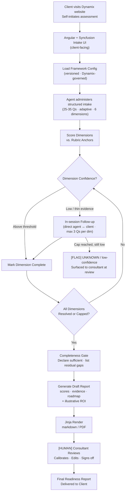

# AI Readiness Assessment Discovery Agent — Design Document

## Revision History

| Version | Date       | Author      | Notes                                                                                                                                                         |
| ------- | ---------- | ----------- | ------------------------------------------------------------------------------------------------------------------------------------------------------------- |
| 0.1     | 2026-05-12 | Zach Robida | Initial draft                                                                                                                                                 |
| 0.2     | 2026-05-12 | Zach Robida | Realigned with Problem (b): agent administers client-facing intake interview via a public Angular + Syncfusion UI; consultant role moves to draft review only |

---

## 1. Problem Framing

> This section captures the initial business requirements defined by the stakeholders prior to transformation into assessment variables leveraged for AI/Agent evaluation.

**Current state:** Dynamix consultants run AI readiness assessments through a manual interview-and-deliverable process: they conduct a discovery conversation with each mid-market client, score the organization's maturity across six dimensions by hand, and assemble a recommendation document themselves. At current volume this process does not scale — each engagement requires significant consultant time for work that is largely repeatable.

**Desired outcome:** A prospective mid-market client self-initiates an assessment from Dynamix's website. The agent administers the discovery interview directly to the client — a structured intake across six dimensions, with adaptive follow-up where evidence is thin — and produces a scored, evidence-backed draft readiness report (including a 12/24/36-month roadmap). A Dynamix consultant enters only at the draft-review stage to calibrate, edit, and sign off before delivery. Consultant time is removed from interview facilitation and concentrated on judgment.

**Success signal:** (1) Supported score rate ≥ 85%: the percentage of dimension scores the consultant can trace to specific interview evidence without re-scoring from scratch. (2) Escalation rate ≤ 20%: the share of dimensions flagged as low-confidence or UNKNOWN per engagement. Both are proposed baselines pending Dynamix confirmation; both apply to agent-administered interviews, not pre-completed forms.

> Success should be defined beyond metrics alone in any client-facing application. One of the most important factors Manhattan considers is referenceability
---

## 2. Scope

A prompt-only baseline fails: the agent must load a versioned framework config, drive a live multi-section interview, maintain scoring state across six dimensions with conditional follow-up loops, evaluate a completeness gate, and render a structured report. This multi-step stateful workflow with branching per-dimension logic and a client-facing interactive surface requires Tier 3 (Agent). No enterprise retrieval platform exists; the agent scores against a structured config, not a document corpus.

### In Scope

- Agent-administered structured intake interview (25–35 questions across 6 dimensions) served through a public client-facing web UI; questions are adaptive (skip/branch based on prior answers)
- Direct agent ↔ client adaptive follow-up for low-confidence dimensions (capped at 3 per dimension), served in-session in the same UI immediately after the structured section
- Self-service engagement initiation: client arrives via the Dynamix website; the agent captures engagement metadata (company profile, role of respondent) in the opening intake section
- Rubric scoring against the versioned Dynamix framework config (1–5 scale per dimension + sub-criteria)
- Completeness gate: explicit declaration when all dimensions are resolved or follow-up caps are reached
- Per-dimension: score + supporting evidence + confidence indicator + gap flag (when applicable)
- Composite tier assignment across all six dimensions
- 12/24/36-month roadmap with clearly labeled illustrative ROI projections
- Jinja-rendered output: editable markdown + PDF for consultant review
- Configurable framework definition (dimensions, sub-criteria, rubric anchors, weights) — tunable by Dynamix without code changes

### Out of Scope

- Vendor, product, or implementation partner recommendations
- Certification program guidance
- Historical benchmarking across prior engagements
- CRM integration; in-app consultant review workflow (consultant edits rendered markdown directly in this iteration)
- Deep technical implementation playbooks
- Production-grade abuse handling / WAF / bot mitigation on the public surface — assumed delivered by Dynamix's standard website infrastructure, not part of this agent design
- Working prototype: this iteration delivers the design and a synthetic-data sample report only; no live deployment

---

## 3. Assumptions & Constraints

### Assumptions

1. The agent administers the full discovery interview to the client via a dedicated Angular + Syncfusion intake UI hosted on Dynamix's website; there is no pre-completed form. The engagement is self-initiated by the client.
2. The framework definition (dimensions, sub-criteria, rubric anchors, composite weights) is maintained by Dynamix in a versioned config file; the agent loads the active version at engagement start and has no write access. The framework version is pinned per engagement so a mid-engagement Dynamix update does not perturb a live interview.
3. The framework is industry-agnostic at the dimension level; no scope or jurisdiction filtering is needed for this iteration.
4. Follow-up is direct agent ↔ client, served in the same intake UI immediately after the structured section for any low-confidence dimension. The consultant does not participate in the live interview.
5. The rendered markdown is the delivery artifact; there is no in-app consultant review workflow in this iteration. The consultant edits the markdown directly before converting to the final PDF.
6. Synthetic discovery responses are hand-authored by Dynamix to author the **sample readiness report deliverable**; they simulate what a real client would enter through the production UI and exercise the full scoring range (1–5 across all dimensions).
7. ROI projections are illustrative only; the agent labels them explicitly as such. The consultant performs an ROI sanity-check before delivery.
8. **[LOAD-BEARING]** Two distinct identity surfaces exist — (a) client-facing intake on the public website, (b) consultant draft-review interface. Both auth models are UNKNOWN at this design layer. Production must specify: client engagement gating (open form vs. lead-capture vs. invite link), abuse / rate-limit posture, and consultant SSO. Without resolution, the design cannot ship to production.
9. Supported score rate (85%) and escalation rate (20%) are proposed — **require Dynamix confirmation** before the eval harness is built.
10. No data residency or air-gap requirements identified. Managed Cloud (Anthropic API) assumed. Because real client intake data flows through the system from day one (there is no pre-screening consultant in the loop), a data classification and privacy review is a **production prerequisite**, not deferred to post-launch.
11. Client identity and engagement metadata (company name, employee count, revenue band, industry, respondent role) are captured in the first section of the intake itself. The agent uses this metadata to size and tailor the interview but does not authenticate the client.

### Constraints

- **Technology:** Python backend (orchestrator + scoring + report generation); Anthropic Claude API; Jinja2 for report rendering; framework config in versioned JSON/YAML; Angular + Syncfusion (AI components) for the client-facing intake UI.
- **Data:** Synthetic or fictional intake data only in this design iteration. Real client intake data is in scope from day one of production deployment and requires a prior data classification review.
- **Autonomy:** The agent does not deliver reports to clients. Every report is reviewed, calibrated, and approved by a Dynamix consultant before client delivery. No auto-send.

---

## 4. Architecture Overview



### Component Inventory

| Component                          | Technology                           | Role                                                                                                                                       |
| ---------------------------------- | ------------------------------------ | ------------------------------------------------------------------------------------------------------------------------------------------ |
| Client-facing intake UI            | Angular + Syncfusion (AI components) | Hosted on Dynamix website; renders the adaptive questionnaire + inline follow-up turns; surfaces agent feedback to the client in real time |
| API gateway / backend orchestrator | Python (FastAPI or similar)          | Brokers between client UI, framework config store, scoring engine, follow-up loop, and report renderer; holds per-engagement session state |
| Framework config store             | JSON / YAML (versioned)              | Dimension definitions, sub-criteria, rubric anchors, composite weights; Dynamix-governed; version pinned per engagement                    |
| Scoring engine                     | Python + Claude                      | Applies rubric to streaming intake responses; outputs per-dimension score + confidence; identifies dimensions needing follow-up            |
| Follow-up loop                     | Python + Claude                      | Multi-turn conversation directly with the client per low-confidence dimension; capped at 3 questions; transcript preserved                 |
| Completeness gate                  | Python                               | Evaluates whether all dimensions meet confidence threshold or follow-up cap; flags residual gaps for consultant                            |
| Report generator                   | Claude (Anthropic)                   | Produces per-dimension narrative, roadmap, and illustrative ROI projections from scored dimensions                                         |
| Report renderer                    | Jinja2                               | Renders draft report to editable markdown + PDF                                                                                            |

---

## 5. Data Flow

### Data Sources

| Source                                                              | Type                                               | Format                                           | Notes                                                                                                                                                      |
| ------------------------------------------------------------------- | -------------------------------------------------- | ------------------------------------------------ | ---------------------------------------------------------------------------------------------------------------------------------------------------------- |
| Framework config (dimensions, rubric anchors, weights)              | Dynamix-authored (versioned)                       | JSON / YAML                                      | Loaded at engagement start; version pinned and recorded with each engagement artifact                                                                      |
| Discovery interview responses (structured intake + follow-up turns) | Per-engagement (from client via web UI)            | Structured form data + free-text follow-up turns | 25-35 structured questions across 6 dimensions, plus up to 3 follow-up turns per low-confidence dimension; all collected in a single client-facing session |
| Engagement metadata                                                 | Per-engagement (from client, first intake section) | Structured form data                             | Company name, employee count, revenue band, industry, respondent role; used to size and tailor the interview                                               |
| Synthetic discovery responses (sample report)                       | Synthetic                                          | Structured form data + free-text follow-ups      | Hand-authored to simulate a real client through the production UI; exercises the full 1–5 scoring range for the sample deliverable                         |

### Processing Pipeline

1. **Engagement initiation:** A prospective client arrives at the Dynamix website and self-initiates an assessment. The agent presents the engagement-metadata section first (company profile, respondent role) so subsequent questions can be sized to the organization. The agent then administers the structured intake section-by-section through the Angular UI; responses stream back as each section is submitted.

2. **Load Framework Config:** The active versioned framework config is loaded in full and pinned to this engagement. The version identifier is recorded in the engagement artifact. The agent has no write access to this config. A mid-engagement Dynamix tuning event will not perturb a live interview.

3. **Score Dimensions:** For each of the six dimensions, the agent applies the rubric anchors to the relevant intake responses, produces a 1–5 score, and generates a confidence indicator. Dimensions where intake evidence is thin or ambiguous are flagged for follow-up. Scoring runs incrementally as sections complete, not in a single batch at the end.

4. **Follow-up Loop (conditional):** For each low-confidence dimension, the agent generates a targeted follow-up question and the client answers directly in the UI — up to 3 turns per dimension. After each response, confidence is re-evaluated. If the cap is reached without sufficient evidence, the dimension is marked UNKNOWN/low-confidence and flagged for the consultant.

5. **Completeness Gate:** After all dimensions are scored or capped, the agent declares completeness: all dimensions above the confidence threshold are marked complete; residual gaps are listed explicitly for consultant attention.

6. **Draft Report:** Claude generates the per-dimension narrative (score, evidence summary, gap flags), the composite tier, the 12/24/36-month roadmap, and illustrative ROI projections (labeled as such). The agent abstains on any dimension where evidence cannot support a defensible score.

7. **Render & Stage:** Jinja renders the report to editable markdown and PDF. The markdown artifact and full follow-up transcript are routed to the consultant review queue.

---

## 6. Agent Decision Logic

### Scoring / Classification Rules

| Signal               | Rule                                                                                | Source                                       | Notes                                                                   |
| -------------------- | ----------------------------------------------------------------------------------- | -------------------------------------------- | ----------------------------------------------------------------------- |
| Rubric anchor match  | Intake evidence is matched to the closest anchor on the 1–5 scale per sub-criterion | Framework config                             | Deterministic threshold logic; Claude resolves ambiguous matches        |
| Confidence threshold | Dimension confidence below a configurable threshold triggers follow-up              | Framework config (tunable)                   | Default threshold is Dynamix-configurable without code change           |
| Follow-up cap        | Maximum 3 follow-up questions per dimension                                         | Framework config (Dynamix-configurable)      | Cap prevents runaway conversation; dimensions exceeding cap are flagged |
| Completeness gate    | All dimensions above confidence threshold OR follow-up cap reached                  | Python logic                                 | Deterministic gate; not Claude-dependent                                |
| ROI projection       | Illustrative only; scaled from rubric score + dimension weight                      | Framework config + architect-defined formula | Always labeled illustrative; never presented as a guarantee             |

### Confidence Levels

| Level   | Criteria                                                                         | System Behavior                                                                    |
| ------- | -------------------------------------------------------------------------------- | ---------------------------------------------------------------------------------- |
| High    | Intake evidence maps clearly to a rubric anchor; multiple sub-criteria supported | Dimension scored; no follow-up needed                                              |
| Medium  | Evidence present but ambiguous or partially covering sub-criteria                | Dimension scored provisionally; follow-up loop triggered                           |
| Low     | Evidence thin or contradictory; rubric anchor cannot be selected confidently     | Follow-up loop triggered; if cap reached, dimension flagged UNKNOWN for consultant |
| UNKNOWN | Follow-up cap reached without sufficient evidence                                | No score committed; flagged explicitly in report gap list for consultant           |

### Prompt Design

| Prompt Element                         | Position                                          | Notes                                                                        |
| -------------------------------------- | ------------------------------------------------- | ---------------------------------------------------------------------------- |
| Role + task instructions               | First (stable — cached)                           | Neutral assessment facilitator; rubric-bound; no vendor recommendations      |
| Abstention and scope rules             | First (stable — cached)                           | Must abstain when evidence cannot support a defensible score; no fabrication |
| Citation format rules                  | First (stable — cached)                           | Every score cites specific intake response(s) as evidence                    |
| Framework config content               | Second (semi-stable — cached until Dynamix tunes) | Full dimension definitions, sub-criteria, rubric anchors, weights            |
| Intake responses                       | Dynamic                                           | Per-engagement form data                                                     |
| Follow-up chat history (if applicable) | Dynamic                                           | Appended per dimension turn                                                  |

### Structured Output Schema

```python
from pydantic import BaseModel
from typing import Optional, List, Literal, Dict

class DimensionScore(BaseModel):
    dimension_id: str
    dimension_name: str
    score: Optional[int]              # 1–5; None if UNKNOWN
    confidence: Literal["high", "medium", "low", "unknown"]
    evidence: List[str]               # Intake response citations supporting the score
    gap_flags: List[str]              # Sub-criteria without sufficient evidence
    requires_consultant_review: bool  # True when confidence is low or unknown

class RoadmapItem(BaseModel):
    horizon: Literal["12_month", "24_month", "36_month"]
    dimension_id: str
    recommendation: str
    illustrative_roi: Optional[str]   # Always labeled illustrative

class ReadinessReport(BaseModel):
    engagement_id: str
    framework_version: str
    composite_tier: Optional[int]     # 1–5 composite; None if any dimension is UNKNOWN
    dimensions: List[DimensionScore]
    roadmap: List[RoadmapItem]
    completeness_declaration: str     # Agent's explicit statement on what is resolved vs. flagged
    consultant_gap_list: List[str]    # UNKNOWN dimensions for consultant to resolve
    requires_consultant_review: bool  # Always True
```

---

## 7. Human Checkpoints

| Checkpoint                       | Trigger                                       | What the Human Sees                                                                                    | Human Action                                                         | If No Action Taken                                                          |
| -------------------------------- | --------------------------------------------- | ------------------------------------------------------------------------------------------------------ | -------------------------------------------------------------------- | --------------------------------------------------------------------------- |
| UNKNOWN dimension review         | Dimension flagged after follow-up cap reached | Dimension name + gap description + best-effort partial score                                           | Provide additional context / accept gap / override score             | Dimension remains UNKNOWN in report; consultant adjusts narrative at review |
| Full report review & calibration | Rendered draft report delivered               | All dimension scores + evidence + confidence indicators + roadmap + ROI projections + UNKNOWN gap list | Calibrate scores / edit narrative / add context / override / approve | Report stays in draft; not delivered to client                              |
| ROI projection sign-off          | Report includes illustrative ROI figures      | ROI figures clearly labeled as illustrative; sanity-check prompt from agent                            | Confirm projections are reasonable / adjust narrative                | Report stays in draft                                                       |

### What Humans Remain Accountable For

- **Final calibration** of all dimension scores before client delivery
- **UNKNOWN resolution** — the consultant decides whether to probe further, accept the gap, or override
- **ROI sanity-check** — illustrative projections are the consultant's professional judgment, not the agent's
- **Client delivery** — no report reaches the client without consultant sign-off

---

## 8. Failure Modes

| Failure Mode                          | Trigger                                                                              | System Response                                                                                                                                                       | Human Action Required                                                                                                   |
| ------------------------------------- | ------------------------------------------------------------------------------------ | --------------------------------------------------------------------------------------------------------------------------------------------------------------------- | ----------------------------------------------------------------------------------------------------------------------- |
| Insufficient intake evidence          | Intake responses too thin to score a dimension                                       | LOW confidence flagged; in-session follow-up loop triggered                                                                                                           | None until cap reached; if 3 turns elapse without resolution, dimension is UNKNOWN                                      |
| Follow-up cap reached                 | 3 follow-up questions answered without resolution                                    | Dimension marked UNKNOWN; included in consultant gap list                                                                                                             | Consultant resolves directly with client offline or accepts gap in report                                               |
| Conflicting intake responses          | Client's answers to related sub-criteria contradict each other                       | Conflict flagged; both versions surfaced; no score committed                                                                                                          | Consultant resolves with client before finalizing                                                                       |
| Client abandons interview mid-session | Browser closed / inactivity timeout before completeness gate reached                 | Session state persisted under engagement ID; partial-engagement notice surfaced to the consultant queue                                                               | Consultant decides whether to discard or re-engage the client offline (resume-link capability deferred to product team) |
| Public-surface abuse                  | Spam / bot submissions / adversarial input on the open intake form                   | Rate-limit and bot mitigation handled at web tier before reaching agent; agent-layer prompt-injection guardrails reject malformed slot contents and abort the session | None required if web-tier controls hold; security team alerted if guardrails fire repeatedly                            |
| Framework config version mismatch     | Config has been updated since the engagement started                                 | Agent uses the pinned version for the duration of the engagement; flags the mismatch in the engagement artifact                                                       | Consultant decides whether to re-run on the new version or document the pinned version used                             |
| Out-of-scope question                 | Client asks about vendor recommendations, certification, or implementation playbooks | Agent declines gracefully; stays within assessment scope                                                                                                              | None required; consultant addresses out-of-scope questions directly at delivery                                         |

### "I Don't Know" Cases

- Intake evidence does not map to any rubric anchor for a sub-criterion → dimension follows the follow-up path; if unresolved after 3 turns, score is withheld and flagged UNKNOWN
- Consultant asks agent to recommend a specific vendor or product → out of scope; agent declines
- Two intake responses contradict each other for the same sub-criterion → conflict surfaced, no score committed until consultant resolves

### Financial / Reputational Risk Scenarios

| Risk Scenario                                     | Potential Impact                                                                | Design Protection                                                                               |
| ------------------------------------------------- | ------------------------------------------------------------------------------- | ----------------------------------------------------------------------------------------------- |
| Wrong maturity score delivered to client          | Client pursues wrong strategic priorities; Dynamix advisory credibility at risk | Consultant calibration gate before all client delivery; scores are traceable to intake evidence |
| Illustrative ROI misread as guaranteed projection | Client makes financial commitments based on agent-generated numbers             | ROI projections are always labeled illustrative; consultant performs explicit sanity-check      |
| UNKNOWN dimension delivered without disclosure    | Client receives incomplete assessment without knowing gaps                      | UNKNOWN dimensions are listed explicitly in the consultant gap list and surfaced in the report  |

---

## 9. Governance & Security

**Deployment:** Managed Cloud via Anthropic API. No data residency or air-gap constraints identified. Real client intake data flows through the system from day one of production deployment (there is no pre-screening consultant in the loop); a data classification and privacy review is a **production prerequisite**, not deferred to post-launch. Client-org data describing internal practices is commercially sensitive and must be handled accordingly.

### Data Handling

- All engagement artifacts (intake responses, follow-up transcripts, scored report) are persisted per-engagement with the framework version recorded.
- Synthetic data is used only to produce the sample-report deliverable; production handles real client data and must complete the data classification review before launch.
- The client must be presented with a data-handling notice and (where applicable) consent before the intake begins. This notice is a Dynamix legal / web-team dependency, not part of the agent itself.

### Access Control

- Two distinct identity surfaces exist:
  - **Client-facing intake** on the public Dynamix website — gating model UNKNOWN (open form vs. lead-capture vs. invite-link). Production must decide and pair the choice with appropriate abuse / rate-limit controls.
  - **Consultant draft-review** interface — auth UNKNOWN; likely SSO. Required before consultant traffic touches real engagement artifacts.
- Both surfaces are flagged in §3 Assumption #8 as load-bearing open items.

### Security

- **Prompt injection (elevated risk):** The intake surface is **public and untrusted**, raising prompt-injection risk versus a consultant-mediated model. Required mitigations:
  - Intake responses are serialized into typed slots and injected into context turns, **never concatenated into the system prompt**.
  - Follow-up generation runs with output-validation guardrails (schema-validated response shape; rubric-bound topic enforcement).
  - Abuse signals from the web tier (rate-limit hits, captcha failures, content filter triggers) surface to the agent layer and can terminate a session.
- **Least privilege:** Agent has no write access to the framework config or scoring rubric. Write actions are limited to the per-engagement artifact (report + transcript). The framework config is immutable from the agent's perspective.

---

## 10. Cost & Latency

> Estimates for a single engagement: 30-question intake, 6 dimensions, ~2 follow-up turns per dimension on average. Runtime spans the client's live web session; client think-time is excluded from agent latency targets but drives the UI's loading-state UX requirements.

| Operation                                    | Model / Service   | Est. Latency | Est. Cost / Run | Notes                                         |
| -------------------------------------------- | ----------------- | ------------ | --------------- | --------------------------------------------- |
| Framework config load + initial scoring      | claude-sonnet-4-6 | ~5–8s        | ~$0.01–0.02     | ~4K token context (config + intake)           |
| Follow-up loop (6 dimensions × ~2 turns avg) | claude-sonnet-4-6 | ~3–5s/turn   | ~$0.005/turn    | ~12 turns est.; transcript appended each turn |
| Report generation                            | claude-sonnet-4-6 | ~8–12s       | ~$0.02–0.04     | Scored dimensions + roadmap + ROI; ~5K output |
| Jinja render                                 | Jinja2            | ~1–2s        | Negligible      | Markdown + PDF                                |
| **Total per engagement**                     |                   | **~75–120s** | **~$0.10–0.20** | Scales with number of follow-up turns         |

### Service Targets

| Indicator                        | Target | Notes                                                       |
| -------------------------------- | ------ | ----------------------------------------------------------- |
| Initial scoring response         | ~8s    | Config + intake loaded; Sonnet reasoning step               |
| Follow-up turn latency           | ~5s    | Incremental context append; shorter than initial            |
| p95 end-to-end (full engagement) | ~120s  | Includes follow-up loop; consultant-paced turns not counted |
| Error rate                       | < 5%   | API errors + malformed output combined                      |

### Cost Control Measures

- Stable system prompt (role, abstention rules, citation format) + framework config at the prompt prefix for cache efficiency; framework cache invalidates only on Dynamix version updates.
- Follow-up turns append only the new dimension context; prior dimensions' evidence is not re-sent.
- Report generation is a single model call after all dimensions are resolved — no per-dimension generation calls.
- Output is bounded by the report template structure; Claude is instructed not to elaborate beyond scored evidence.
- Stream the intake section-by-section so dimensions are scored incrementally as the client submits each section, rather than in a single batch at the end. Reduces perceived latency for the client and lets the follow-up loop begin earlier in the session.

---

## 11. Future Improvements

- Live consultant tooling: in-app review workflow replacing direct markdown editing
- CRM integration to pull prior engagement context and surface benchmark comparisons
- Lead-capture / CRM hook on engagement completion: a client who completes the intake becomes a sales-qualified lead routed to Dynamix sales (deferred until CRM integration lands)
- Resume-link capability for clients who abandon a session mid-interview, allowing them to re-enter and complete from where they left off
- Historical benchmarking across prior engagements (deferred: requires engagement data store and anonymization)
- Closed-loop framework tuning: surface recurring UNKNOWN patterns to Dynamix for rubric improvement
- Multi-language intake and report support for international engagements

---

## Appendix A — Framework Config Schema

```yaml
version: "1.0.0"
dimensions:
  - id: "data_infrastructure"
    name: "Data Infrastructure & Governance"
    weight: 0.20
    sub_criteria:
      - id: "data_quality"
        anchors:
          1: "No formal data quality processes"
          3: "Data quality monitored in key systems"
          5: "Automated data quality enforcement across enterprise"
  # ... 5 additional dimensions
composite_weights:
  method: "weighted_average"
confidence_threshold: 0.70      # Tunable; triggers follow-up below this value
follow_up_cap: 3                # Max follow-up questions per dimension
roi_projection_formula: "..."   # Illustrative formula; Dynamix-maintained
```

---

## Appendix B — Key Design Decisions

| Decision                                                       | Alternatives Considered                                                                                                 | Rationale                                                                                                                                                                                                                                                                                                 |
| -------------------------------------------------------------- | ----------------------------------------------------------------------------------------------------------------------- | --------------------------------------------------------------------------------------------------------------------------------------------------------------------------------------------------------------------------------------------------------------------------------------------------------- |
| Agent-administered client-facing intake (Angular + Syncfusion) | (a) Consultant pre-collects and submits a completed form; (b) consultant relays a chat session between client and agent | Problem (b) explicitly requires the agent to interview the client. Syncfusion's AI-aware questionnaire components provide adaptive UX with real-time feedback that matches the design's confidence-gated branching. Consultant time stays focused on calibration of the draft, not interview facilitation |
| Self-service engagement initiation (client-initiated)          | Consultant-initiated engagement (consultant qualifies the lead before any client sees the form)                         | Maximizes productization leverage: zero consultant time until a draft exists. Trade-off: requires public-surface abuse controls and upfront engagement-metadata capture in the intake itself (see §3 Assumption #11)                                                                                      |
| Tier 3 (Agent) over Tier 2 (RAG)                               | RAG with rubric docs as a retrieval corpus                                                                              | The agent needs to maintain scoring state across 6 dimensions, branch into per-dimension follow-up loops, and evaluate a completeness gate — none of which is achievable with a single retrieve-then-generate pass                                                                                        |
| Config-based framework (no vector retrieval)                   | Embed rubric docs in a vector store                                                                                     | The rubric is structured and versioned, not free-text; exact-match config loading is deterministic, cheaper, and easier to version than chunk-based retrieval                                                                                                                                             |
| Per-dimension follow-up cap (3 questions)                      | Uncapped follow-up until confidence threshold                                                                           | An uncapped loop creates unpredictable conversation length and latency; the cap bounds the engagement and forces explicit UNKNOWN handling rather than endless probing                                                                                                                                    |
| Managed Cloud over self-hosted                                 | Self-hosted (Ollama, vLLM)                                                                                              | PoC scope uses synthetic data only; no sovereignty or air-gap constraints identified; managed cloud minimizes infrastructure overhead for a 2-week sprint                                                                                                                                                 |
