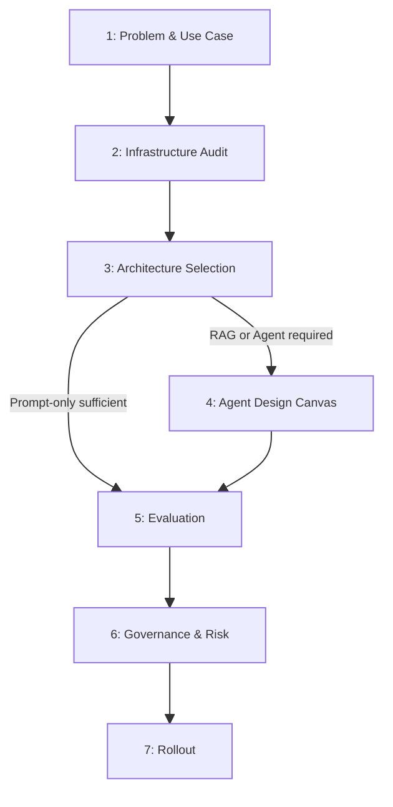

# Task 4 — AI Readiness Assessment Discovery Agent: Evaluation Report

**Client input:** `design_exercise_artifacts/task_4_ai_readiness_assessment/task_4_design_intake.md`
**Template version:** 0.2
**Completed at:** 2026-05-12
**Evaluator notes:** Tier 3 Agent; 10 UNKNOWN fields concentrated in eval targets, security, and rollout; infrastructure tooling for Dynamix's own stack unspecified.

---

## Summary

Dynamix Group is building an internal discovery agent that automates their AI readiness assessment engagement: it ingests a structured 25-35 question intake form, scores the response against a 6-dimension maturity rubric (1-5), conducts a targeted follow-up chat loop per underspecified dimension, and produces a Jinja-rendered draft readiness report (with roadmap) for consultant review before client delivery. The system warrants a **Tier 3 (Agent)** architecture due to the multi-step scoring loop, branching follow-up conversation, completeness gate logic, and structured report generation. There are **10 UNKNOWN fields**, primarily around infrastructure (no existing tooling described for Dynamix's own stack), quantitative success targets, and deployment constraints.

---

## Phase Overview

---

## 1. Problem & Use Case

### 1.1 Use Case Statement

| Field | Response |
| ----- | -------- |
| When (situation / trigger) | A Dynamix consultant initiates an AI readiness assessment engagement with a mid-market client (200–2,000 employees) | confidence: INFERRED |
| I need to (task / motivation) | Ingest structured intake responses, score them against a 6-dimension maturity rubric, conduct targeted follow-up for low-confidence dimensions, and produce a draft readiness report with roadmap | confidence: FOUND | source: "Discovery agent ingests structured intake responses, scores them against the rubric, and identifies dimensions requiring follow-up" |
| So I can (expected outcome) | Scale the assessment process without losing rigor — delivering consistent, consultant-reviewed readiness reports across many engagements | confidence: FOUND | source: "needs to scale without losing rigor" |
| Who are the users? | Dynamix consultants (primary users / reviewers); assessed organization staff complete intake form but do not interact with agent directly | confidence: FOUND | source: "consultant is referred to as 'user,' the assessed organization as 'client'" |
| Current workflow | Manual interview-and-deliverable process: consultant conducts discovery conversation and assembles recommendation document by hand | confidence: FOUND | source: "Today this is a manual interview-and-deliverable process" |

### 1.2 Is AI the Right Tool?

| Gate | Answer | Confidence |
| ---- | ------ | ---------- |
| Task well-defined with clear inputs/outputs? | Yes — structured 25-35 question intake; output is a scored, dimensioned report in a defined template | FOUND |
| Requires language understanding or generation? | Yes — follow-up chat loop requires NLU; report generation requires coherent narrative prose | FOUND |
| Correctness requires human-level judgment? | Partially — scoring is rubric-driven but consultant retains final calibration authority | FOUND |

**Recommendation:** `human_in_loop_required` — draft report is always reviewed by a Dynamix consultant before client delivery.

### 1.3 Success Criteria

| Criterion | Metric | Target | Confidence |
| --------- | ------ | ------ | ---------- |
| Answer quality | Supported answer rate | UNKNOWN | UNKNOWN |
| User adoption | Task completion rate | UNKNOWN | UNKNOWN |
| Escalation rate | % of dimensions requiring human override | UNKNOWN | UNKNOWN |

---

## 2. Infrastructure Audit

### 2.1 Existing Knowledge Systems

| Field | Value | Confidence |
| ----- | ----- | ---------- |
| Enterprise search platform exists? | No — no enterprise search or knowledge platform mentioned for Dynamix's internal operations | INFERRED |
| Platform name | NA | NA |
| API or MCP integration available? | NA | NA |

### 2.2 Existing Tooling

| Category | What exists | Integration complexity | Confidence |
| -------- | ----------- | ---------------------- | ---------- |
| Identity / auth | UNKNOWN | UNKNOWN | UNKNOWN |
| Data stores | Jinja template store (implied); versioned framework config store | Low-Medium | INFERRED |
| Communication platforms | UNKNOWN — no chat or collaboration platform mentioned for consultant UX | UNKNOWN | UNKNOWN |
| Line-of-business systems | None in scope — CRM integration and live consultant tooling explicitly excluded | None | FOUND |

---

## 3. Architecture Selection

| Field | Value | Confidence |
| ----- | ----- | ---------- |
| Selected tier | Tier 3 — Agent | INFERRED |
| Rationale | The workflow requires multi-step orchestration with branching logic (conditional follow-up per dimension), state across turns, and structured artifact generation. Tier 1 and 2 are insufficient; Tier 4 fine-tuning not warranted at PoC scope. | INFERRED |

---

## 4. Agent Design Canvas

### 4.1 Use Case & Triggers

| Element | Value | Confidence |
| ------- | ----- | ---------- |
| Use case goal | Score a mid-market organization across 6 AI readiness dimensions, conduct targeted follow-up for low-confidence dimensions, and produce a consultant-reviewable draft report with a 12/24/36-month roadmap | FOUND |
| Triggers | Consultant submits completed client intake form (25-35 questions) to the agent | INFERRED |
| Channels | Jinja-rendered web form (intake); follow-up chat loop (text interface); Jinja-rendered markdown → PDF (output) | FOUND |

### 4.2 Knowledge & Data

| Source | Format | Update frequency | Owner | Confidence |
| ------ | ------ | ---------------- | ----- | ---------- |
| Framework definition (dimensions, sub-criteria, scoring rubric, weights) | Structured config (JSON/YAML) | On Dynamix tuning events | Dynamix | FOUND |
| Structured intake responses (25-35 questions per engagement) | Structured form data | Per engagement | Client / consultant | FOUND |
| Follow-up chat transcript | Unstructured text | Per engagement | Agent / consultant | FOUND |
| Synthetic discovery responses (PoC only) | Hand-authored structured responses | Static for PoC | Dynamix | FOUND |

| Field | Value | Confidence |
| ----- | ----- | ---------- |
| Ingestion approach | `diy` — framework config loaded directly; no document corpus or vector store | INFERRED |
| Chunking strategy | NA — agent operates on structured config and form responses, not free-text chunks | NA |
| Curation owner | Dynamix (framework config); consultant (final report calibration) | FOUND |
| Update handling | Framework versions governed by Dynamix; agent loads active version; prior engagement reports pinned to version used | INFERRED |

**Metadata schema:**

| Field | Required? | Confidence |
| ----- | --------- | ---------- |
| Source / document type | Yes — distinguish framework config from intake responses from transcripts | INFERRED |
| Date / version | Yes — framework definition must carry a version; engagement artifacts carry engagement date | FOUND |
| Approval status | Yes for framework config (Dynamix-approved version only); N/A for intake | INFERRED |
| Scope / jurisdiction | No — framework is industry-agnostic at dimension level | FOUND |

### 4.3 Tools & Integrations

| Tool | Action type | Reversible? | Requires human approval? | Confidence |
| ---- | ----------- | ----------- | ------------------------ | ---------- |
| Intake form reader | Read | Yes | No | FOUND |
| Rubric scorer | Compute | Yes | No (output flagged for consultant review) | FOUND |
| Follow-up chat conductor | Read/Write (conversation state) | Yes | No (consultant reviews transcript) | FOUND |
| Completeness gate evaluator | Compute | Yes | No (flagged dimensions escalated to consultant) | FOUND |
| Report renderer | Write (Jinja → markdown/PDF) | Yes | No (consultant edits before delivery) | FOUND |

### 4.4 Flows & Orchestration

| Field | Value | Confidence |
| ----- | ----- | ---------- |
| Selected pattern | `pipeline` with conditional inner loop per dimension | INFERRED |
| Rationale | Intake ingestion → scoring → conditional follow-up (per low-confidence dimension, max 3 turns) → completeness gate → report generation. Each step is sequential with defined hand-off artifacts. | FOUND |

### 4.5 Instructions & Behavior

| Element | Decision | Confidence |
| ------- | -------- | ---------- |
| Agent role / persona | AI readiness assessment facilitator operating on behalf of a Dynamix consultant; neutral, structured, rubric-bound; does not recommend vendors or partners | FOUND |
| Output format | Jinja-rendered markdown → PDF; per-dimension score block + composite tier + 12/24/36-month roadmap + confidence indicators + consultant-review gap list | FOUND |
| Citation behavior | Must surface evidence per scored dimension and per sub-criterion; confidence indicators required per dimension | FOUND |
| Abstention behavior | Must abstain on a dimension when discovery data cannot support a defensible score; flag UNKNOWN/low-confidence findings explicitly rather than fabricate | FOUND |
| Scope boundary | Vendor/product/partner recommendations; certification programs; historical benchmarking; CRM integration; deep technical implementation playbooks; live consultant tooling | FOUND |

### 4.6 Agent Architecture & Components

| Component | New or existing | Notes | Confidence |
| --------- | --------------- | ----- | ---------- |
| Structured intake form (Jinja-rendered) | New | 25-35 questions across 6 dimensions; rendered per engagement | FOUND |
| Framework config store | New | Versioned dimension definitions, sub-criteria, rubric anchors, composite weights; editable by Dynamix without code change | FOUND |
| Scoring engine | New | Applies rubric to intake responses; outputs per-dimension score + confidence; identifies dimensions needing follow-up | FOUND |
| Follow-up chat loop | New | Multi-turn, per dimension, capped at 3 questions; transcript preserved for consultant | FOUND |
| Completeness gate | New | Evaluates whether all dimensions are above confidence threshold or follow-up cap reached; flags residual gaps | FOUND |
| Report renderer | New | Jinja template → markdown → PDF; supports consultant editing before delivery | FOUND |
| Consultant review interface | Out of scope (PoC) | Excluded explicitly; consultant edits rendered markdown file directly | FOUND |

---

## 5. Evaluation

### 5.1 Quality Metrics

| Metric | Target | Confidence |
| ------ | ------ | ---------- |
| Supported answer rate | UNKNOWN | UNKNOWN |
| Abstention rate | UNKNOWN | UNKNOWN |
| Task completion rate | UNKNOWN | UNKNOWN |

### 5.2 Abstention Behavior

| Scenario | Required behavior | Confidence |
| -------- | ----------------- | ---------- |
| No relevant sources | Abstain on dimension; flag as UNKNOWN for consultant review | FOUND |
| Low confidence match | Conduct follow-up chat (up to 3 questions); if still below threshold, flag dimension as low-confidence for consultant | FOUND |
| Conflicting sources | UNKNOWN — not explicitly addressed; likely escalate to consultant but not stated | UNKNOWN |
| Question out of scope | Agent must not answer; scope boundary excludes vendor recommendations, certification, implementation playbooks | FOUND |

---

## 6. Governance & Risk

### 6.1 Human-in-the-Loop Gates

| Action | Risk level | Gate | Confidence |
| ------ | ---------- | ---- | ---------- |
| Draft report delivery to client | High — reputational and advisory risk if scores are wrong | Mandatory consultant review before any client delivery; consultant owns final calibration, narrative, ROI sanity-check, and overrides | FOUND |
| Dimension abstention / UNKNOWN declaration | Medium | Agent flags explicitly; consultant decides whether to probe further or accept gap | FOUND |
| ROI projection publication | High — illustrative projections only; must not be mistaken for guarantees | Consultant performs ROI sanity-check; projections labeled as illustrative | FOUND |

### 6.2 Security

| Field | Value | Confidence |
| ----- | ----- | ---------- |
| Prompt-injection mitigation | UNKNOWN — not addressed | UNKNOWN |
| Tool least-privilege | Agent has no write access to framework definition or scoring rubric; all tools read-only or compute except report write | FOUND |
| Sensitive-field redaction | UNKNOWN — no PII/sensitive data handling policy stated | UNKNOWN |

### 6.3 Data & Deployment Constraints

| Requirement | Present? | Impact | Confidence |
| ----------- | -------- | ------ | ---------- |
| Data residency | UNKNOWN | UNKNOWN | UNKNOWN |
| Air-gap / on-prem | No — PoC scope with synthetic data only; no on-prem requirement stated | INFERRED |
| Regulated data | No real client data in scope — fictional/synthetic data only for PoC | FOUND |

| Field | Value | Confidence |
| ----- | ----- | ---------- |
| Selected deployment model | `managed_cloud` | INFERRED |
| Rationale | PoC scope, no real data, no residency/air-gap constraints stated; managed cloud minimizes infrastructure overhead for a fixed-scope 2-week sprint | INFERRED |

---

## 7. Rollout

| Artifact | Versioned? | Requires eval before deploy? | Confidence |
| -------- | ---------- | ---------------------------- | ---------- |
| System prompt | Yes (implied by framework versioning) | Yes | INFERRED |
| Retrieval configuration | NA — no vector retrieval pipeline | NA |
| Model version | UNKNOWN | UNKNOWN | UNKNOWN |
| Tool definitions | Yes (implied by framework versioning) | Yes | INFERRED |

| Field | Value | Confidence |
| ----- | ----- | ---------- |
| Rollback trigger | UNKNOWN — no automated rollback criteria defined | UNKNOWN |

---

## Appendix: Decision Summary

| Decision | Selected | Rationale | Confidence |
| -------- | -------- | --------- | ---------- |
| Architecture tier | Tier 3 — Agent | Multi-step workflow with branching follow-up loop and state across turns cannot be served by prompt-only or RAG | INFERRED |
| Existing retrieval platform? | No | No enterprise search or document retrieval platform mentioned | INFERRED |
| Ingestion approach | `diy` — structured config load | Agent scores against structured rubric from config, not a retrieved document corpus | INFERRED |
| Orchestration pattern | `pipeline` with conditional inner loop | Sequential stages with defined hand-off artifacts; bounded follow-up loop embedded | INFERRED |
| Deployment model | `managed_cloud` | PoC scope, no real data, no residency/air-gap constraints | INFERRED |
| Primary rollback trigger | UNKNOWN | No automated rollback criteria defined | UNKNOWN |

---

## Appendix: Open Items

| Item | Phase blocked | Why this matters | Suggested resolution path |
| ---- | ------------- | ---------------- | ------------------------- |
| Supported answer rate target not defined | Phase 5 | Without a numeric target, the team cannot write a passing/failing eval harness for PoC sign-off | Ask Dynamix: what % of dimension scores must be verifiable against intake evidence to consider the agent production-ready? |
| Task completion rate target not defined | Phase 5 | No acceptance criterion for the completeness gate or full end-to-end run | Define during PoC: track how often agent reaches completeness gate without intervention across synthetic test cases |
| Escalation rate target not defined | Phase 5 | Cannot calibrate the confidence threshold or follow-up cap without a target | Propose a default (e.g., <20% of dimensions flagged per engagement) and validate against synthetic scenarios |
| Conflicting intake response behavior not specified | Phase 5.2 | If two intake responses for the same sub-criterion contradict each other, agent behavior is undefined | Specify: escalate to consultant, use conservative (lower) score, or flag as UNKNOWN |
| Identity / auth tooling for Dynamix's stack unknown | Phase 2 | Cannot assess SSO, access control, or multi-consultant isolation without knowing the auth stack | Check with Dynamix IT: is there an existing SSO or identity provider the PoC should integrate with? |
| Communication platform for consultant report delivery unknown | Phase 2 | Determines how the consultant receives and reviews the draft markdown report | Ask Dynamix: is the markdown file delivered via email, shared drive, Slack, or lightweight web UI? |
| Prompt-injection mitigation strategy not defined | Phase 6.2 | Intake responses are free-text and could carry adversarial content targeting the LLM | Define: input sanitization, system prompt hardening, output validation layer |
| Sensitive-field redaction policy not defined | Phase 6.2 | Pattern must be defined before handling real client intake data in production | Clarify: will intake responses ever contain employee names, org chart details, or financial specifics that must be masked in logs? |
| Rollback trigger not defined | Phase 7 | Without a rollback criterion, a degraded model or changed rubric version could silently produce wrong scores | Define: e.g., if supported answer rate drops below threshold on eval suite, revert to prior framework version and system prompt |
| LLM vendor and model version not specified | Phase 7 | Model version pinning and eval-before-deploy discipline cannot be applied without knowing the target model | Confirm with Dynamix: preferred LLM provider and whether model version must be pinned for consistency across engagements |
| Data residency requirement not addressed | Phase 6.3 | If any future engagement handles data with regional residency requirements, current managed-cloud assumption may be invalid | Ask Dynamix: is there a geographic region requirement for the cloud deployment? |
